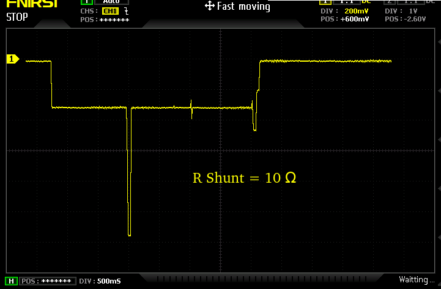

# main
- Versão funcional no envio de LoRaWAN ABP:
    - WCM Versão 0.00.04 04/01/2026 Build: 0004
    - Branch CmdUart
- Utiliza placa WCM com:
    - RFM95W
    - Speed Studio, XIAO ESP32-C3
- Recebe comandos pela UART, nesta versão só está ativo o CMD 'A' (LoRaWAN ABP)

### Comentários
- Os parâmetros LoRaWAN são enviados junto com a linha de comando
- O módulo consome algo como 2,1 segundos para cada transmissão

### Próximos passos
- Documentar o código
- Suporte ao ESP32-C3 Mini Super
- Iniciar testes com OTAA
- Avaliar melhorias no consumo

### Consumo do Módulo WCM com transmissão ABP

## Versão 0.00.05 - 14/01/2026 - Build: 0005
Add Suporte para LoRaWAN OTAA