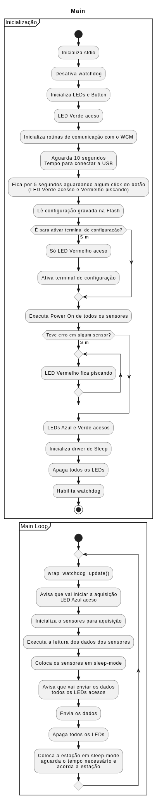
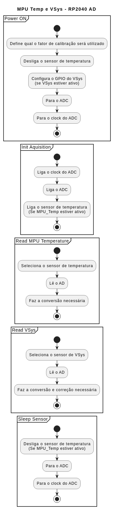
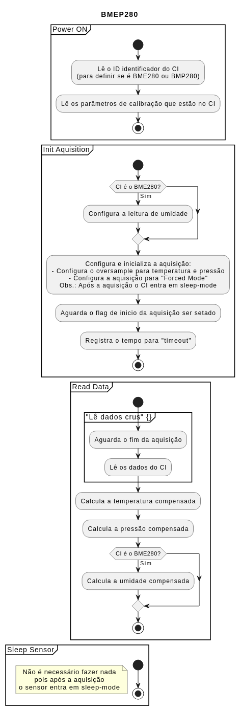
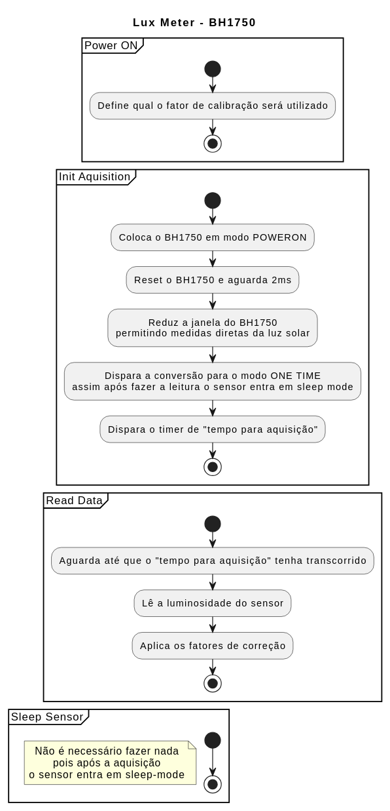
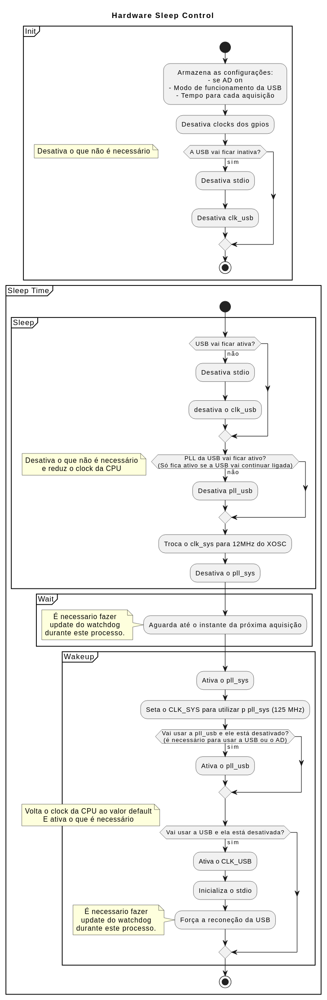
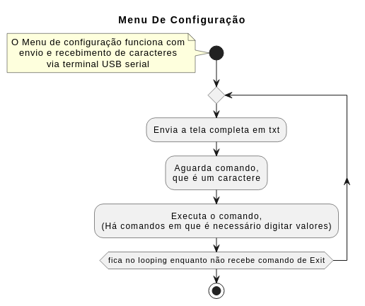
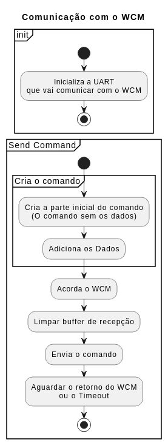

# Descrição do Código da Estação Meteorológica IoT
Rev: Beta01   Data: 07/02/2026

## Configurações pelo usuário
Os parâmetros configuráveis pelo usuário são feitos apenas através do monitor serial e está descrito claramente no manual do usuário. Resumidamente as principais são:
- Modo LoRa e seus parâmetros
- Sensores ativos na estação
- Definição do tempo para cada leitura
- Configuração de recursos de log, LEDs e USB (Obs. eles afetam o consumo da estação).

Estes parâmetros podem ser salvos em flash (no menu de configuração) assim sendo desnecessário a reconfiguração quando se reenergiza a estação.

## Configurações pelo programador
Os parâmetros de configuração de compilação ficam em:
- CMakeLists.txt
Utilizado para definir configurações específicas para debug
- code_config.h
Arquivo que concentra todas as principais configurações do código, destacando-se:
    - PICO_WITH_DEBUG_PROBE, se definido habilita o uso do debug probe reconfigurando as portas UART a serem utilizadas
    - DEBUG_ON e derivados, habilitam printf de log para depuração
    - WATCHDOG_ENABLED, se definido ativa o funcionamento do watchdog
    - START_SEND_WITH_FIX_DATA, se definido faz com que as 5 primeiras transmissões sejam valores conhecidos independentes do valor lido, útil para debug
    - SLEEP_STATE_BY_GPIO, se definido faz que durante os períodos de sleep os gpio reflitam o funcionamento do Sleep mode, util para debug
    - INITIAL_DELAY_MS, define o tempo, em milissegundos, de espera inicial para rodar o programa, permitindo assim conectar a interface serial (USB) antes do programa iniciar
    - USB_TURN_ON_TIME_S, define o tempo, em segundos, que vai esperar a USB ligar quando no modo de log ON-OFF
    - ADD_CHECKSUM_ON_PAYLOAD, adiciona uma sum e xor dos bytes do payload com objetivo de verificar a integridade do mesmo (util para debug)

## Funcionamento do código
A estrutura do código foi definida visão o baixo consumo da estação. Para isso foi utilizado os recursos de colocar os sensores em sleep-mode e desativar ao máximo os recursos não utilizados da rp2040 bem como reduzir seu clock nos momentos de sleep-mode, o que reduz expressivamente seu consumo.

**Obs.: Os fluxogramas são versões simplificadas do código com intuito de mostrar os pontos principais do código. Tratamento de erros e timeout geralmente não estão incluídos.**

### main.c
A rotina main tem como função inicializar todos os dispositivos após o power on e manter o main-loop.

### aq_data
Neste arquivo há:
- A definição de uma variável que armazena os dados de todos os sensores;
- Um grupo de funções que tem como objetivo chamar as funções equivalentes de cada sensor quando este está ativo (Obs.: O sensor é definido como ativo pelo usuário na configuração do sistema).

Funções:
- aqdata_init_power_on: Utilizada apenas após o power-on/reset do software;
- aqdata_init_aq: chamada no main-loop após o MPU acordar e tem como função acordar os sensores e inicializar as aquisições dos mesmos;
- aqdata_read: chamada após a aqdata_init_aq, le os dados dos sensores;
- aqdata_sleep: chamada após a aqdata_read, tem como objetivo colocar os sensores em sleep-mode quando for o caso.

### aq_data_ad
Driver do AD para leitura da MPU Temperature e VSys.
Desliga e liga quando não necessários:
- Sensor de temperatura
- O AD
- O Clock do AD

### aq_data_bmep280
Obs.: O sensor de: temperatura, pressão, e umidade é o bme280, mas caso se utilize o bmp280, que não tem o módulo de umidade, ele será reconhecido e tratado corretamente, apenas o dado de umidade será reportado como ERRO.

Funcionamento
- A rotina após o reset lê qual CI está instalado e lê os dados de calibração presentes no CI
- Para cada leitura é necessário:
    - Setar o mode de oversample de cada unidade.
    - Disparar o modo de  aquisição, no caso se está usando o Forced Mode que inicia uma aquisição e após ela estar concluida faz o CI entrar em sleepo-mode
    - Para fazer a leitura correta é necessário:
        - Aguardar o flag de em aquisição true
        e após
        - Aguardar o flag de em aquisição false
        Obs.: O flag demora uns 450us para ficar true, caso não se aguarde ele ficar true e só se verifique que ele esta false, pode-se estar lendo a aquisição anterior.
    - Fazer as compensações com os parâmetros de calibração.

### aq_data_gps

### aq_data_lux
O sensor de luminosidade, luxímetro, é o BH1750.
Como a leitura dele é afetada pela proteção que o envolve há um fator de correção configurável pelo usuário (detalhes no manual do usuário).
O sensor BH1750 consome algo em torno de:
- 115 uA quando ativo
- 3.7 uA quando em sleep-mode
Por isso está sendo setado o modo em que ele faz uma leitura e já entra em sleep-mode, reduzindo o consumo.

### buttons_and_leds
Configura o Driver dos LEDs e botão
- A porta do botão é configurada como input e com um pullup
- A porta dos LEDs serão configuradas como output e como zero
- Obs.: durante a inicialização cada LED fica aceso por: LED_INIT_DELAY_MS

### est_config
Define as estruturas utilizadas para a configuração da estação
Possui funções para manipular a configuração:
- Ler da flash
- Salvar na flash
- Definir valores default
Obs.: Os valores que são salvos e lidos na flash possuem um "HASH-like" para verificação da integridade

### hw_sleep
Para que o sistema consuma o mínimo de energia é necessario desativar módulos desnecessarios.
Entre uma aquisição e outra o número de recurso necessários e muito baixo podendo a maioria ser desligado, mas que devem ser ligados quando se for efetuar a aquisição e transmissão dos dados,
O Clock da CPU tem um grande impacto no consumo sendo que sua redução durante o periodo entre aquisições é relevante.
Temos duas funções:
- init, que desativa tudo que não será utilizado permanentemente
- sleep, que:
    - desativa tudo que não for necessário entre aquisições;
    - aguarda até o momento da próxima aquisição
    - ativa tudo o que é necessário para a próxima aquisição

### loop_printf
 Rotina que "embrulha" o printf em loop_printf
 Funciona como o printf só que:
 - a função loop_printf é chamada no lugar do printf pelas rotinas que são executadas dentro do main-loop
 - Foi criada pensando em futuras melhorias, para ser usada quando o USB está off ==> inativar o printf

### menu_conf
O menu de configuração funciona enviando e recebendo caracteres txt para o terminal;
Para gerar a tela é iniciado com uma sequencia de caracteres que faz "ir" para o topo da tela. Ai são enviadas todas as linhas formatadas.
O programa aguarda um caractere que será tratado como comando. Este comando é executado e o processo se repete.
Obs.: Caso o comando seja Exit a rotina é encerrada, voltando para a execução do programa principal.

### storage
Obs.: Este arquivo é uma simplificação do utilizado na fase2.

O ponto mais relevante é que para que se escrever na flash tem que ser garantido que não ocorrerá nenhum outro acesso a flash até que a operação de escrita seja feita.
Para isso normalmente todas as interrupções devem estar inativas e o programa de escrita rodar a partir da RAM. Para isso utiliza-se na definição da função a expressão: __not_in_flash_func

### wcm
A rotina de envio do WCM consta de:
- Criar o comando
    - Monta a parte que depende apenas da configuração
    - Adiciona o payload dos dados recém adquiridos
- Enviar o comando
    - Ativar o WCM para receber dados
    - Enviar o comando
    - Aguardar a resposta

### wrap_watchdog
Rotinas que embrulham (wrap) as rotinas originais do wathdog
Permitindo assim serem facilmente habilitadas ou desabilitadas: WATCHDOG_ENABLED