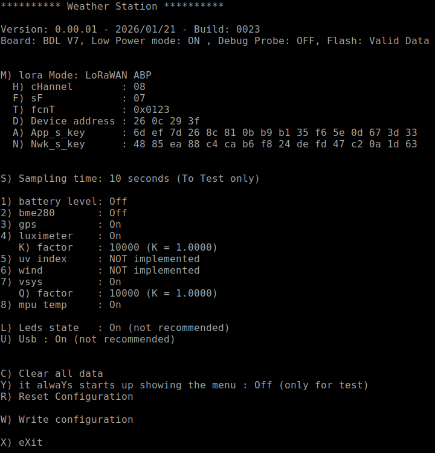
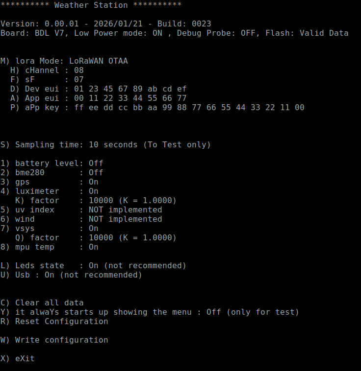
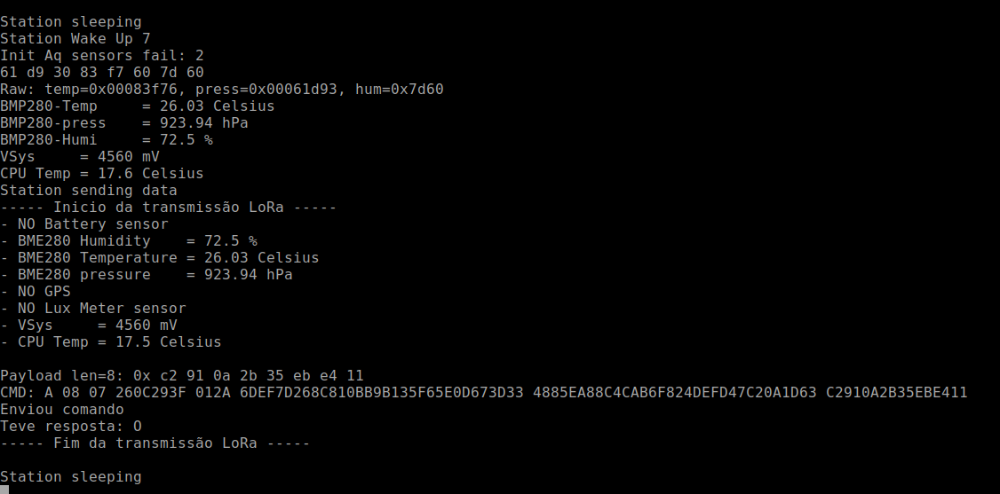

# 📖 Manual do Usuário – Estação Meteorológica IoT com LoRaWAN

Autores: **Antonio**, **Carlos** e **Ricardo**

Versão: 0.00.03 de 25/01/2026

## Índice

- [📖 Manual do Usuário – Estação Meteorológica IoT com LoRaWAN](#-manual-do-usuário--estação-meteorológica-iot-com-lorawan)
  - [Índice](#índice)
  - [1. Apresentação do Sistema](#1-apresentação-do-sistema)
  - [2. O que você recebeu](#2-o-que-você-recebeu)
  - [3. Visão Geral do Funcionamento](#3-visão-geral-do-funcionamento)
  - [4. Instalação Física da Estação](#4-instalação-física-da-estação)
  - [5. Configuração da Estação](#5-configuração-da-estação)
    - [5.1 Parâmetros LoRaWAN](#51-parâmetros-lorawan)
    - [5.2 Definição dos Intervalos de Coleta](#52-definição-dos-intervalos-de-coleta)
    - [5.3 Seleção dos Sensores Ativos](#53-seleção-dos-sensores-ativos)
    - [5.4 Seleção dos Modos de Log](#54-seleção-dos-modos-de-log-afetam-o-consumo-da-estação)
    - [5.5 Opções Adicionais do Menu](#55-opções-adicionais-do-menu)
  - [6. Funcionamento da Estação](#6-funcionamento-da-estação)
    - [6.1 Indicações dos LEDs da Placa](#61-indicações-dos-leds-da-placa)
    - [6.2 Indicações do Monitor Serial](#62-indicações-do-monitor-serial)
  - [7. Configuração do The Things Network (TTN) Gateway](#7-configuração-do-the-things-network-ttn-gateway)
  - [8. Configuração do TheThingsBoard](#8-configuração-do-thethingsboard)
  - [9. Especificações Técnicas da Estação](#9-especificações-técnicas-da-estação)
    - [Principais características](#principais-características)
    - [Características dos sensores homologados](#características-dos-sensores-homologados)
---

## 1. Apresentação do Sistema

A Estação Meteorológica IoT é um sistema para monitoramento ambiental distribuído, projetado para operar de forma autônoma e com baixo consumo energético. A solução utiliza comunicação **LoRaWAN**, permitindo a coleta e visualização remota de dados meteorológicos por meio de plataformas web.

O sistema foi desenvolvido, primeiramente, para aplicações no Agronegócio e na Agricultura Familiar, tendo sido estendido posteriormente para aplicações acadêmicas, experimentais e de pesquisa. Como parte do projeto, o campus universitário da Unicamp possibilitará a instalação de múltiplas estações distribuídas geograficamente.

---

## 2. O que você recebeu

- Uma caixa para a instalação da estação;
- Uma placa da Estação Meteorológica;
- Um módulo WCM;
- Sensores:
  - BH1750, sensor de luminosidade;
  - BME280, sensor de pressão, temperatura e umidade;
  - GPS, sensor de posição;
- 3 Cabos JST XH de 4 pinos;
- Um Painel Solar;
- Manual de instruções.

---

## 3. Visão Geral do Funcionamento

A estação opera de forma totalmente automática após a instalação. O ciclo de funcionamento é composto por:

1. Coleta periódica dos dados ambientais  
2. Processamento local das medições  
3. Empacotamento dos dados  
4. Transmissão via LoRaWAN  
5. Recepção pelo gateway  
6. Armazenamento e visualização no backend  

Não é necessária intervenção do usuário durante a operação normal.

---

## 4. Instalação Física da Estação

Para garantir o funcionamento adequado da estação, siga as orientações abaixo:

1. Instale a estação em local aberto e bem ventilado  
2. Evite proximidade com superfícies metálicas ou obstáculos  
3. Posicione o painel solar voltado para o norte geográfico com uma inclinação que depende da latirude do local de instalação 
4. Instale os módulos segundo os seguintes passos:
   - Conecte os módulos I2C (BH1750 e BME280) na placa da estação com os cabos JST XH de 4 pinos fornecidos;
   - Conecte o GPS na placa da estação com o cabo JST XH de 4 pinos fornecido;
   - Conecte o painel solar a placa da estação atravês do conector KRE;
   - Obs.: Para a configuração inicial será necessário conectar a placa da estação via um cabo usb a um terminal serial.

---

## 5. Configuração da Estação

Obs.: Obrigatória na primeira energização.

- A estação meteorológica inicia automaticamente seu funcionamento assim que é energizada.  
- Para energizar a estação ligue as chaves na sequinte sequência:
	+ SW2
	+ SW3
	+ SW1
- Caso queira ajustar os parâmetros da estação use o terminal serial USB. Para isso pressione o botão Config da placa da estação antes de energizá-la (ou de pressionar o botão Reset). Mantenha pressionado o botão Config até que apenas o LED Vermelho fique aceso (demora aproximadamente 10 segundos). Solte o botão Config.
- A configuração é realizada através de **menus textuais** exibidos no monitor serial.
  - O menu permite ajustar parâmetros gerais, de comunicação, os intervalos de coleta de dados e ativar ou desativar os sensores, conforme será descrito a seguir.
- Para configurar os parâmetros da estação, pressione a letra/número correspondente ao item desejadoo. Alguns parâmentros têm seu valor atualizado automaticamente e outros necessitam que se digite o valor desejado seguido de Enter.

### Tela de Configuração Geral da Estação

As imagens abaixo mostram telas do menu:
  
- Quando configurando parâmetros ABP:
  
  
- Quando configurando parâmetros OTAA:
  
---

### 5.1 Parâmetros LoRaWAN

- Para selecionar entre os modos ABP ou OTAA utilize a tecla M  
- Cada modo tem seus próprios parâmetros configuráveis, sendo:  
	+ Modo ABP:
		* Canal  
		* Sf  
		* fcnt
		* Device Address
		* App_s_Key
		* Nwk_s_Key
 	
  + Modo OTAA:
		* Canal  
		* Sf  
		* Dev EUI
		* App EUI
		* App Key

	- Obs.: Em operação normal os parâmetros Canal e Sf devem está em AUTO.  

---

### 5.2 Definição dos Intervalos de Coleta

Selecione a tecka S para escolher os intervalos de coleta entre 10 segundos (apenas para teste) e 1, 2, 5, 10, 15, 20, 30, 45 ou 60 minutos.  

---

### 5.3 Seleção dos Sensores Ativos

- **1) batery level** – Ainda não implementado.  
- **2) bme280** – Para medir a umidade relativa, a temperatura e a pressão atmosférica.  
- **3) gps** – Para medir a latitude, a longitude e altitude.  
- **4) luxímetro** – Para medir a luminosidade do ambiente. 
    - **K) factor** – Fator de correção do luxímetro.
- **5) uv index** – Ainda não implementado.  
- **6) wind** – Ainda não implementado.  
- **7) vsys** – Para medir a tensão de alimentação da placa.  
    - **Q) factor** – Fatpr de correção do Vsys.
- **8) mpu temp** – Para medir a temperatura interna do microcontrolador.  

---

### 5.4 Seleção dos Modos de Log (afetam o consumo da estação)

- **L) Leds state** – Se ativado, os LEDS exibem o estado da estção, ou seja:
  - Sleeping - Estação em modo de baixo consumo.  
  - Coleta - Estação em modo de aquisição de dados dos sensores.  
  - Transmissão - Estação em modo de envio de dados ao gateway.  

- **U) Usb** – Para escolher entre os modos do USB:  
  - OFF - Desativa a porta USB,  
  - ON - Mantêm a porta USB sempre ativa.  
  - ON-OFF AUTO - Ativa a USB apenas se a estação está em modo de aquisição ou transmissão de dados.  

---

### 5.5 Opções Adicionais do Menu

- **C) Clear all data** – Apaga todos os registros locais, **é necessário ser executado na primeira inicialização da estação**.  
- **R) Reset configuration** – Restaura os parâmetros de fábrica na tela.  
- **W) Write configuratiom** – Salva as alterações das configurações.
- **X) eXit** – Encerra o menu de configuração e ativa a operação da estação.  

---

## 6. Funcionamento da Estação

Após a energização do sistema os LEDs R, G e B pisca rapidamente na sequência vermelho, verde e azul.

Se o botão Config ficar pressionado durante o periodo que os LEDs Verde e Vermelho estiverem acessos a estação entrará em modo de configuração.

### 6.1 Indicações dos LEDs da Placa

Durante a operação, os LEDs acessos indicam:
- Verde e Vermelho ==> Inicializando e aguardado se entra ou não no modo de configuração (dura uns 10 segundos);
- Vermelho ==> Modo de configuração ativo. O menu pode ser acessado pela USB;
- Azul e Verde ==> Sai do menu de configuração e continua a inicialização. Periodo bem curto, menos de 1 segundo;
- Vermelho piscando ==> Falha na inicialização dos sensores. A estação aguarda correção;  
- Azul ==> A estação faz a aquisição dos dados dos sensores;
- Azul, Verde e Vermelho ==> A estação transmite os dados;
- Nenhum LED acesso ==> Periodo entre aquisições. A estação está em baixo consumo.

---

### 6.2 Indicações do Monitor Serial

Durante a operação da estação, se o log USB estiver ativo, o monitor serial mostrará os dados enviados para o servidor, bem como o resultado do envio.  

---

## 7. Configuração do The Things Network (TTN) Gateway

Veja: 
[Link][https://docs.google.com/document/d/1o25VC49TM4YPC_RLyG_XDTTJo1DXNHsViMWomo7teZQ/edit?tab=t.hv56jkize0mv#heading=h.io2alehklfxd]

---

## 8. Configuração do TheThingsBoard

Veja: 
[Link][https://docs.google.com/document/d/1o25VC49TM4YPC_RLyG_XDTTJo1DXNHsViMWomo7teZQ/edit?tab=t.i1ou0k3wh8xg#heading=h.x05q1vx6ttz]

---

## 9. Especificações Técnicas da Estação

### Principais características
  
- Placa principal dedicada com a taspberry pi pico.  
- Software Build: 0021 ou superior.
- Consumo médio:  
	+ Sleep mode: 6 mA
	+ Estação transmitindo os dados coletados: 97 mA  

  Obs.: Sem GPS conectado.  

- Duração estimada da bateria sem alimentação solar (noite, nublado):
  - sem GPS ligado: em avaliação  
  - com GPS ligado: em avaliação  
	+ Considerando:
    - Bateria 18650 de 2000 mA hora  
    - Comunicação a cada 5 minutos  

### Características dos sensores homologados

| Sensor | Grandeza | Unidade | Range | Precisão | Faixa de Operação |Consumo | Outros |
| --- | --- | --- | --- | --- | --- | --- | --- |
| BME280 | Pressão | hPa| 300 a 1100 hPa|+/- 1 hPa (de 0 a +40 ºC) | -40 a +85 ºC | 1120 uA peak | I2C address = 0x60 |
| BME280 | Temperatura | ºC | 0 a 65 ºC| +/-1.0 ºC | |
| BME280 | Umidade relativa | % | 0 a 100 %|  | |
| BH1750 | Luminosidade | lx | 0 a 65535 * |   | -40 a +85 ºC | 190 uA | I2C address = 0x23 0x5C |
