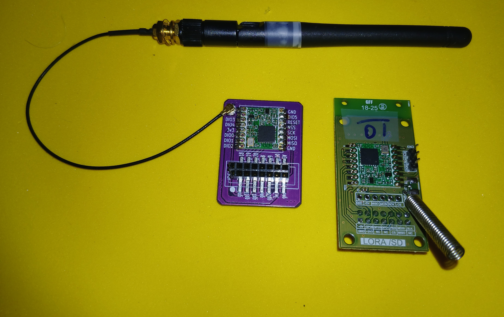
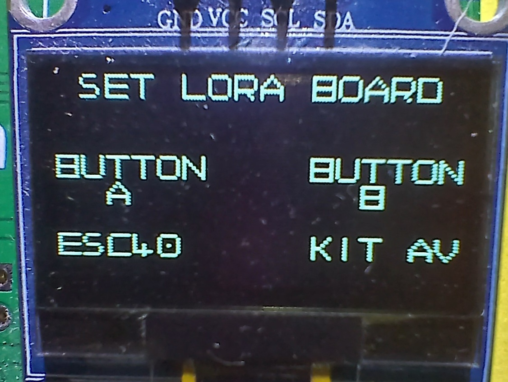
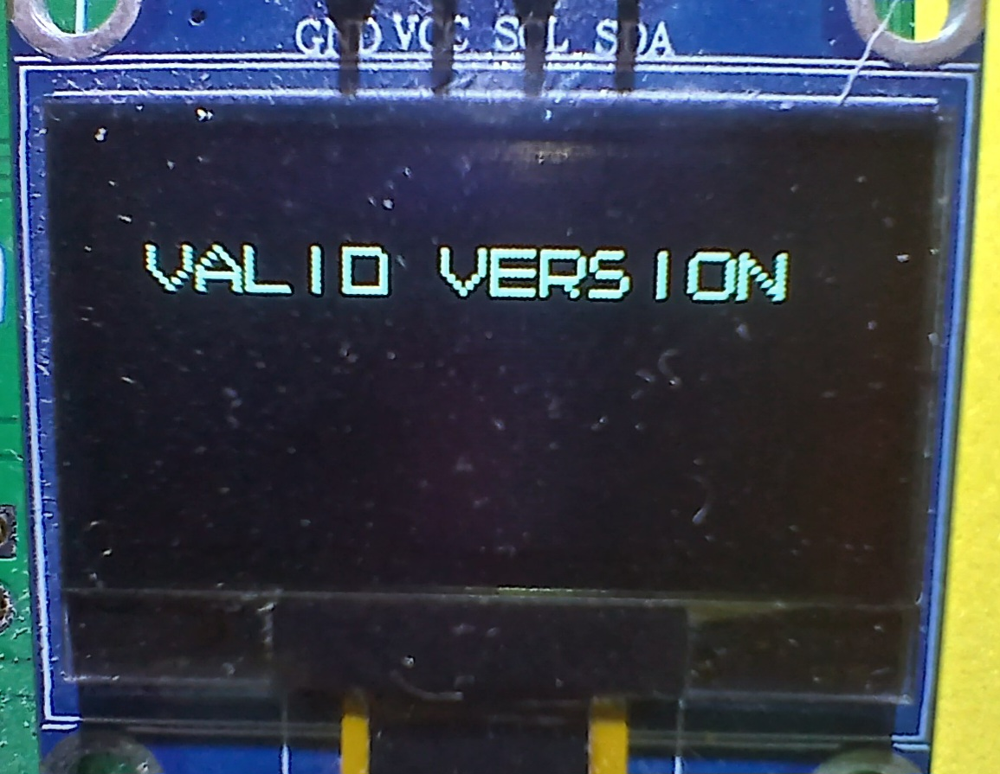
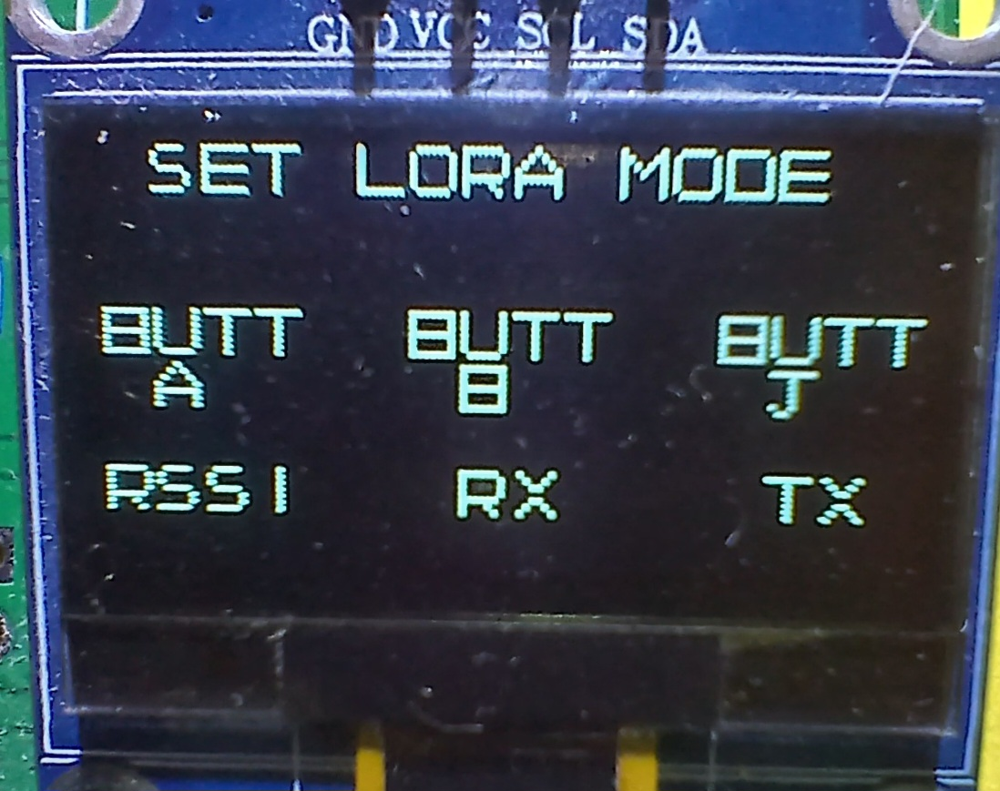
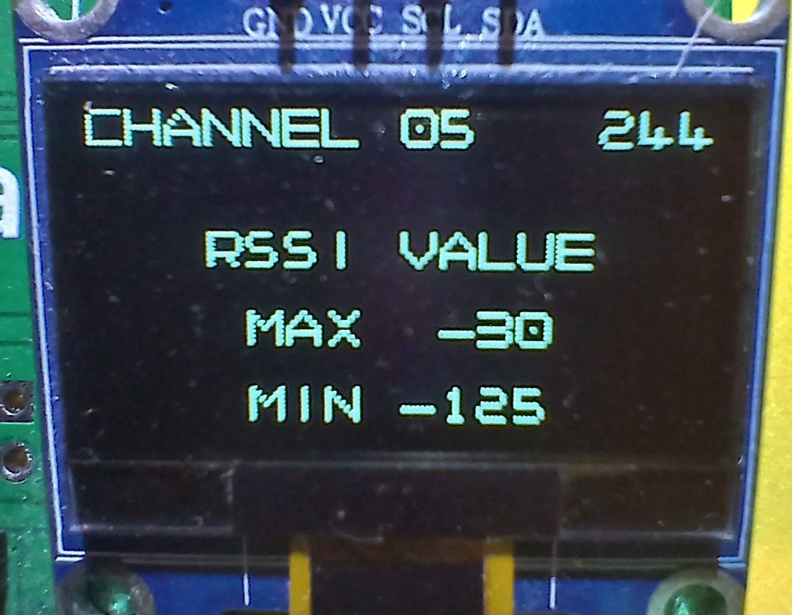

## Relatório Técnico – Testes de Comunicação LoRa em Topologia Ponto-a-Ponto  
**BitDogLab + RFM95W** – Novembro/2025

### 1. Objetivo
Este documento registra os testes realizados com dois rádios LoRa modelo RFM95W utilizando duas placas BitDogLab (RP2040). O objetivo foi validar a comunicação ponto-a-ponto LoRa utilizando firmware próprio em C, com possibilidade de alternar entre modo transmissor (TX) e modo receptor (RX) através dos botões físicos da BitDogLab.

### 2. Montagem e Configuração
- 2 placas BitDogLab v6.3 e v7 com pico w (RP2040)  
- 3 módulos LoRa RFM95W (SX1276), sendo 2 módulos Escola 4.0 e 1 do kit avançado de periféricos  
- Alimentação via USB e bateria (v7)
- Antenas externas conectadas nos dois módulos da Escola 4.0 e pig tail na outra
- Frequência de teste: AU915, canal 5, 915 MHz (compatível Brasil/ANATEL)

  

A pinagem do RFM95W foi mapeada para o SPI0 do RP2040.  
Confirmamos que os módulos estavam vivos através da leitura do registrador VERSION (0x42), que retornou 0x12 nos três rádios. Isto garantiu que o SPI estava funcional antes dos testes de RF.  

### 3. Firmware e Operação
Foi desenvolvido firmware em C baseado no driver uLora.  
Através dos botões da BDL, selecionou-se a placa em teste e seu modo de operação.  

Setting LoRa board:  
| Botão | Função |
|-------|--------|
| A (GPIO5) | força placa Escola 4.0 |
| B (GPIO6) | força placa do kit |

  

Nesse momento, o programa verifica a versão da placa através do registrador 0x42. Se a resposta for 0x12 a versão da placa é validada.

Setting de modo TX/RX:  
| Botão | Função |
|-------|--------|
| A (GPIO5) | força modo RSSI (RX simplificado) |
| B (GPIO6) | força modo RX |
| Botão do Joystick (GPIO22) | força modo TX |

  

### 4. Problemas Encontrados e Mitigações
Durante os testes surgiram problemas técnicos reais, relevantes para projetos futuros:

| Problema | Sintoma | Solução aplicada |
|----------|---------|------------------|
| Necessidade de códigos específicos para cada versão de BDL | OLED não inicializa | definiçãi dos pinos SDA/SCL |
| A placa Escola 4.0 na BDL 7, após algumas leituras | placa trava | ainda em análise |

Observação: É necessário que ambos os devices (TX e RX) utilizem o mesmo SF e canal pois, havendo divergência, impede que ocorra a recepção de mensagens.  

### 5. Resultados
Com ambos os firmwares alinhados e antenas conectadas, obtivemos pacotes LoRa ponto-a-ponto estáveis. Foi possível medir RSSI no receptor em tempo real através de callback do driver.

Valores observados em bancada (aprox 0,5 metro de distância):
- obteve-se valores de RSSI em torno de -30 dBm  

  

### 6. Conclusões Técnicas
- Confirmou-se que duas BitDogLab podem operar LoRa puro sem LoRaWAN.  
- A leitura do REG_VERSION = 0x12 é o teste mais eficiente para avaliar a comunicação SPI.  
- A arquitetura é adequada para:  
  - testes de alcance  
  
### 7. Próximos Passos
- utilizar o protocolo LoRaWAN com gateway  
- integrar TTN + ThingsBoard via Gateway LoRaWAN quando migrar de P2P para LoRaWAN  

Conclusão final: o sistema é operacional, pode medir RSSI de forma consistente, e serve como base para etapas posteriores de integração em rede LoRaWAN privada ou pública.  

