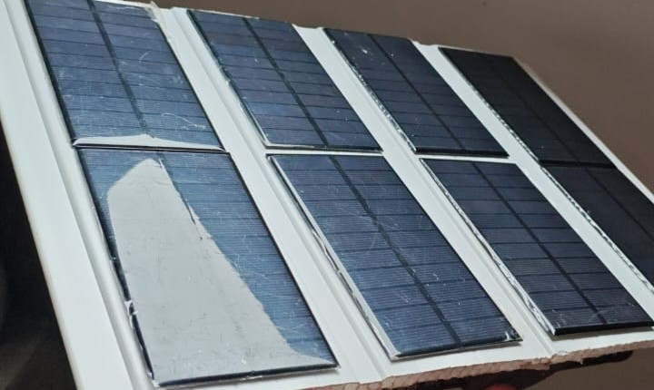
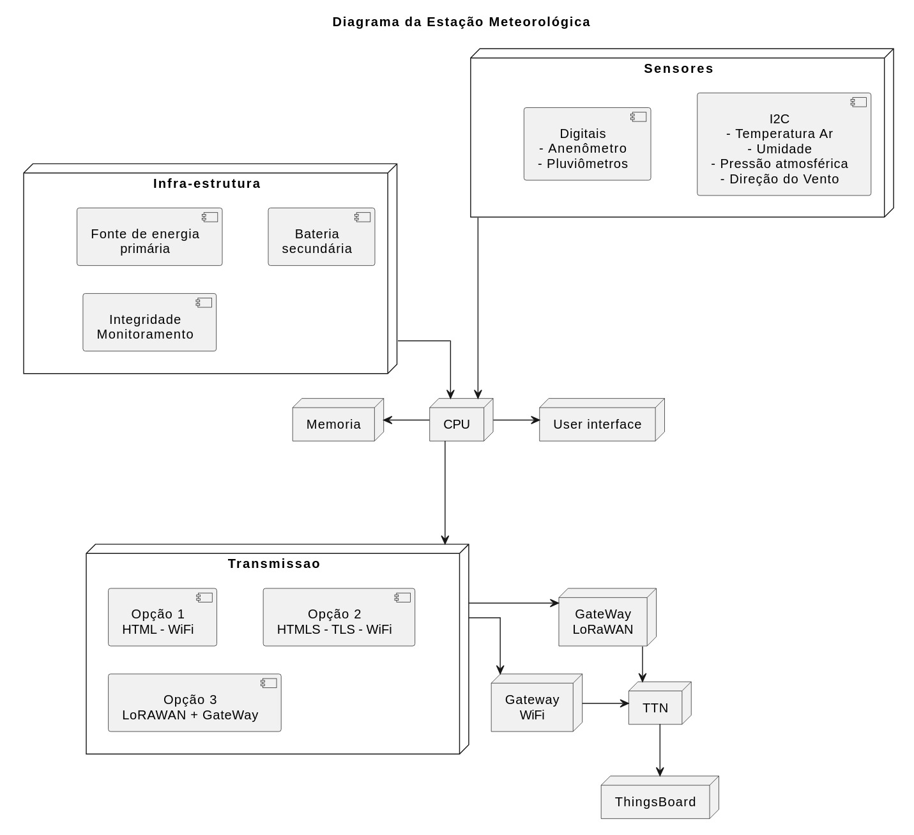

# Estação Meteorológica IoT – Etapa 2 - Semana 2  
## Integração Parcial dos Módulos
#### Autores: Antonio Crepaldi - Carlos Perez - Ricardo Furlan

### 1. Objetivo
Esta etapa teve como finalidade integrar os módulos de hardware e software já desenvolvidos na Estação Meteorológica IoT, estabelecendo comunicação entre sensores e microcontrolador via diferentes protocolos e validando a coerência dos dados trocados.  

Os objetivos específicos incluíram:
- Implementar a comunicação entre sensores e microcontrolador;
- Validar protocolos I²C, SPI, UART e LoRa (WCM – ESP32-C3);
- Garantir sincronismo e estabilidade na coleta e transmissão de dados;
- Iniciar os testes para o uso de placa solar;
- Identificar e corrigir conflitos de hardware e software.

---

### 2. Testes de Integração Realizados

Foram conduzidos testes sistemáticos de comunicação e sincronismo entre os módulos:

1. **Atualização do barramento I²C:**  
   Os sensores I2C que estavam alocados no barramento i2c0 foram transferidos para o barramento i2c1 a fim de liberar aquele para a interface UART visando o uso do módulo GPS.  

2. **Transmissão via LoRa (RFM95W):**  
   Foi utilizado o módulo RFM95W (Escola 4.0) para iniciar os testes de comunicação LoRa ponto a ponto. Além disso, foram também realizados testes com o mesmo módulo do kit avançado de periféricos.  

3. **Análise de placas solares:**  
   Foram iniciadas as tratativas para a utilização de placas solares no projeto. Apesar de ainda não estarem integradas, as primeiras medições com o aplicativo Android Charge Meter, dão conta de uma geração de 1,3 W num dia nublado e 4,2 W com céu limpo. Esses dados implicam em uma geração média, considerando apenas 5 horas de insolação, de entre 6,5 Wh/dia e 21 Wh/dia. Isso resulta numa média de 13 Wh/dia. Com uma margem de 20% de perdas em conversão e armazenamento, sobrariam, para uso efetivo da estação, aproximadamente 10 Wh/dia, em média, variando entre 5,2 Wh/dia e 16,8 Wh/dia. Esses dados, ainda preliminares, adiconados aos dados da bateria (3,7 V e 2 Ah ou 7,4 Wh) permitirão o cálculo prévio de autonomia, após a definição dos payloads e medições mais detalhadas de consumo e tempo de leitura e envio dos dados dos sensores. Mas, pode-se estimar que esse arranjo tem o desafio de ser bem equilibrado para que a estação funcione normalmente mesmo com seguidos dias de tempo nublado. Lembar que as placas devem ser instaladas com suas faces voltadas para o Norte inclinadas 23 graus em relação á vertical.

---

### 3. Resultados e Análises
1. A troca em si do barramento I2C de i2c0 para i2c1 não implicou em complexidade técnica, inclusive pelo fato de, na sua versão 7, a BitDogLab já utilizar o display oled nos pinos 2 e 3, padrão do barramento, evitando conflito com os GPIOs anteriores (14 e 15). Os primeiros testes com o módulo GPS mostraram bons resultados com a comunicação NMEA permitindo a obtenção do posicionamento geográfico com boa precisão.  

2. Foi implementado um firmware para estudo, em linguagem C, que comunica duas BitDogLab via LoRa com três tipos de mensagens enviadas e recebidas, com medição de RSSI  e informação de SF, BW, CR, frequência e SNR. A princípio, na BitDogLab houve a necessidade de eliminar o conflito do circuito do microfone da placa com o pino de reset do módulo RFM95W (GPIO 28), que causava o travamento da comunicação. Isso foi realizado simplemente trocando a posição do jumper que seleciona se o GPIO 28 recebe o sinal diretamente do microfone, para uso de ADC, ou de uma fonte externa, apesar do esforço demandado em descobri-lo.
O firmware utilizado permite a seleção de função da placa BitDogLab como transmissora, receptora ou medidora de RSSI.  

---

### 4. Registro Fotográfico do Protótipo

A foto abaixo mostra os módulos RFM95W disponíveis para teste de comunicação.  

  

As placas solares sob teste estão mostradas abaixo:  

  

O objetivo é integrar esses módulos à estação meteorológica, que aparece abaixo:  

  

---

### 5. Diagrama de Integração Atualizado

O diagrama de integração atualizado aparece abaixo:  

---

### 6. Observações e Próximos Passos

Nessa etapa do projeto, o foco esteve em efetivar os primeiros testes de conexão via LoRa e no uso das placas solares.  Os resulatados se mostraram bastante promissores.

Próximos passos do projeto:  

- Definir as mensagens LoRaWAN (payload) que serão transmitidas, a fim de determinar o Time on Air (ToA) aquilatando os requisitos restritivos do servidor de rede.  
- Avaliar o consumo geral de energia para dimensionar o sistema de placas solares e determinar a autonomia em diferentes condições climaticas.  
- Estudo para reestruturação do firmware de modo a acomodar a restrição atual de implementação de downlink LoRaWAN para reconhecer quais dados foram enviados e adequadamente recebidos pelo servidor de rede.  
- Iniciar estudos para a caixa que abrigará os dispositivos em campo.  

---
