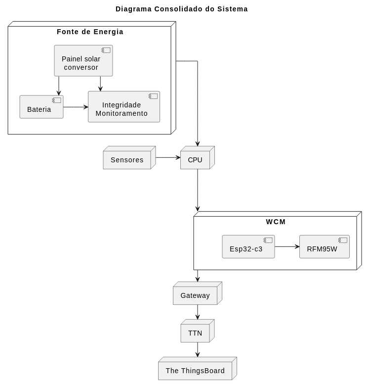

# **Relatório Técnico – Etapa 2 / Semana 3**

**Estação Meteorológica IoT com Comunicação LoRaWAN**
**Autores:** Antonio Crepaldi – Carlos Perez – Ricardo Furlan
**Data:** 23/11/2025

---

## **1. Objetivo da Semana**

A Semana 3 da Etapa 2 teve como prioridade **consolidar o sistema parcialmente integrado**, avaliando estabilidade, coerência entre módulos e revisando o nível atual de maturidade tecnológica (**TRL**).

As atividades principais objetivaram:

* Consolidação das integrações realizadas nas semanas anteriores;
* Aprendizado e familiarização com as stacks **TTN e ChirpStack**, visando a sua integração na fase final;
* Simulações com a comunicação LoRa ponto a ponto;
* Simulações de tráfego LoRaWAN com containers Docker;
* Revisão de arquitetura e padronização do firmware;
* Avaliação de consumo do hardware atual e da geração de energia com placas solares;
* Análise realista do TRL do projeto neste momento.

---

## **2. Estado Atual do Sistema Integrado**

O andamento do projeto e seu cronograma foram impactados por fatores externos críticos:

* A ausência de placas WCM prontas, impossibilitando a etapa essencial de testes reais da comunicação LoRaWAN com ESP32-C3, gateway e servidor de rede;  
* O código original do projeto da WCM apresenta limitações quanto à implementação de downlink na comunicação LoRaWAN, essencial pára a efetivação da comunicação diferida da estação;  
* A utilização de deep sleep, essencial para o gerenciamento do consumo de energia da estação, não foi tampouco, implementado no projeto original.  

Esses fatores implicam num esforço adicional para a consecução do projeto e o cumprimento do cronograma previamente estabelecido.  

Com base na Semana 1 e 2, o sistema integrado até o momento inclui:

### **2.1 Comunicação e Sensores**

* Sensores I²C migrados para barramento **I2C1**, liberando I2C0 para UART/GPS;  
* GPS operando com leitura NMEA quando conectado;  
* Módulo LoRa **RFM95W** validado em operação ponto-a-ponto LoRa (não LoRaWAN) entre duas BitDogLab, com RSSI estável e parâmetros SF, BW e CR ajustáveis.  

### **2.2 Energia**

* Primeiros testes reais com placas solares mostraram **capacidade média estimada de 10 Wh/dia**.  

### **2.3 Testes do RFM95W**

* Os testes permitiram:

  * Troca de modo TX/RX/RSSI;  
  * Leitura de registradores do RFM95W (especialmente o 0x42 – VERSION);  
  * Mitigação do conflito no GPIO28 da BitDogLab com o microfone.  

### **2.4 Integração pendente (por falta de hardware WCM)**

* Testes LoRaWAN via ESP32-C3 (WCM) → adiados
* Teste real de uplink com gateway e servidor
* Coleta real de RSSI/SNR via TTN
* Visualização real dos dados no ThingBoard

---

## **3. Testes Realizados Esta Semana**

Mesmo sem o WCM, foram realizadas as tarefas possíveis previstas no plano:

### **3.1 Testes funcionais do sistema parcialmente integrado**

* Validação do comportamento dos sensores no novo barramento I2C (ok).
* Consolidação da comunicação LoRa P2P com BitDogLab + RFM95W.

### **3.2 Métricas coletadas**

Embora incompletas sem LoRaWAN, as métricas de LoRa puro são relevantes:

| Métrica             | Valor                           |
| ------------------- | ------------------------------- |
| Sucesso de pacotes  | 100% com SF fixo e sincronizado |
| Estabilidade do SPI | validada pelo reg. 0x42 = 0x12  |

**Corrente Raspberry Pico**, programa de led Blink, alimentação 5V
| Condição    | Corrente Led ON | Corrente Led OFF |  
| ----------- | :------------: | :-------------: |
| Default                                | 21,7 mA | 19,4 mA |
| Pll USB Off                            | 19,8 mA | 18,0 mA |
| Pll USB Off CLK=4MHz                |  6,0 mA |  3,9 mA |
| Pll USB Off CLK=4MHz Pll Sys Off |  4,0 mA |  **1,7 mA** |

**Corrente módulo WCN**, alimentação 5V: 31 mA

**Corrente módulo LoRa(RFM95W Kit Avançado)**, alimentação 3,3 V:
- Sem comandos por software:
    - Sem Reset(Reset open): 2,2 mA
    - Com Reset(Reset ground): 0,9 mA
 - Sem comandos por software:
     - modo LoRa + Sleep: **1.6 uA**
     - LoRa Standby: 1.83 mA

**Corrente módulo de Bateria da BitDogLab V7**, Tensão da bateria 4,04V:
- Durante power-on(3leds acessos): 14,8 mA
- Após power-on(leds apagados): **263uA**
- Power off: 50uA

### **3.3 Estudos paralelos sobre TTN**

Como o WCM foi projetado originalmente para integração com **TTN (The Things Network)**, mantivemos estudo das diferenças:

| Item            | TTN         | ChirpStack              |
| --------------- | ----------- | ----------------------- |
| Arquitetura     | Cloud-first | On-premise / local      |
| SLA             | limitado    | controlado pelo usuário |
| Segurança       | integrada   | configurável            |
| Customização    | baixa       | total                   |
| Decodificadores | Web Console | qualquer backend        |

Manteremos compatibilidade com **TTN** para os testes de integração. No futuro do projeto será possível avaliar a utilização alternativa do **ChirpStack**.

### **3.4 Testes Preliminares da infraestrutura ChirpStack**

A equipe conseguiu:

* executar o **ChirpStack via docker-compose**, incluindo:

  * chirpstack-gateway-bridge
  * chirpstack-network-server
  * chirpstack-application-server
  * redis
  * postgres
* acessar os painéis web;
* criar gateways simulados;
* simular uplinks MQTT;
* simular packages LoRaWAN;
* validar decodificadores JSON (codec).

Tudo isso permite o desenvolvimento da parte do servidor servidor, mesmo sem rádio ativo.

---

## **4. Análise Realista do TRL**

A seguir, uma análise crítica do nível de maturidade tecnológica.

### **4.1 Situação Atual**

Apesar dos avanços técnicos, **o TRL não evoluiu tanto quanto planejado**, pois o ponto central desta fase — **testes LoRaWAN reais** — depende do hardware WCM que ainda não está pronto.

### **4.2 Avaliação usando a escala TRL (NASA/EC)**

Escala resumida:

* **TRL 3 – Prova de conceito experimental**
* **TRL 4 – Validação de componentes em ambiente de laboratório**
* **TRL 5 – Validação integrada em ambiente relevante**
* **TRL 6 – Protótipo funcional demonstrado**
* **TRL 7 - Protótipo funcional em campo**

### **4.3 Diagnóstico atual do projeto**

Com base nas semanas 1–3:

| Elemento                  | Situação real                          | TRL                       |
| ------------------------- | -------------------------------------- | ------------------------- |
| Leitura de sensores       | Validada e estável                     | TRL 5                     |
| LoRa ponto-a-ponto        | Validado em bancada                    | TRL 5                   |
| Energia solar             | pré-análise, sem integração real       | TRL 3                   |
| LoRaWAN com WCM           | **não testado, por falta de hardware** | **TRL 2–3**               |
| Infraestrutura TTN | configurada e simulada                 | TRL 4                     |
| Sistema como um todo      | parcialmente integrado                 | **TRL atual estimado: 3-4** |

### **4.4 Justificativa**

Estamos entre TRL 3 e 4, mas não alcançamos TRL 4 porque:

* ainda não existe **demonstração integrada LoRaWAN real**;
* o servidor está configurado, mas não há dados reais entrando;
* não foram realizados testes de downlink, join OTAA, ADR, SNR real etc.

A conclusão técnica é:
**O sistema ainda está em validação de componentes e integração parcial**, sem o protótipo final integrado.

---

## **5. Plano de Ação para a Fase Seguinte (Etapa 3)**

### **5.1 Assim que as placas WCM estiverem funcionais**

1. **Configurar e testar uplink LoRaWAN real** (SF, BW, CR).
2. Validar OTAA e ABP.
3. Registrar métricas reais:

   * SNR
   * RSSI no gateway
   * time-on-air
   * taxa de sucesso
4. Integrar decodificador TTN → The ThingsBoard.

### **5.2 Firmware**

* Unificar o firmware entre sensores, LoRaWAN e lógica de transmissão.
* Incorporar machine-checking simples (failsafe, watchdog).
* Testar duty-cycle.

### **5.3 Energia**

* Medir consumo real do WCM + CPU + sensores.
* Ajustar duty cycle e intervalo de transmissão.
* Validar autonomia real da estação.

### **5.4 Documentação**

* Atualizar repositório com versões consolidadas.
* Gerar gráficos e logs para TRL da Etapa 3.

---

## **6. Diagrama Consolidado do Sistema (Atual)**

Representa o sistema proposto atualizado para o momento:

  

---

## **7. Conclusão**

Apesar do atraso causado pela indisponibilidade das placas WCM, a Semana 3 foi produtiva dentro das limitações:

* consolidamos toda a base técnica desenvolvida;
* validamos sensores, LoRa P2P e parte da arquitetura de energia;
* iniciamos os estudos do ambiente ChirpStack, operando via Docker, como alternativa futura de escalabilidade;
* revisamos o TRL de forma realista, mantendo o projeto dentro de padrões adequados de engenharia.

O projeto segue tecnicamente sólido, com fundações robustas.
A chegada das placas WCM será o gatilho para avançar para TRL 5 e 6.

---

