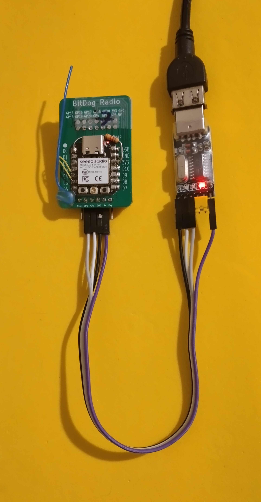

# **Relatório Técnico – Etapa 3 - Semana 1**

### **Estação Meteorológica IoT – Integração Completa do Sistema**

**Autores:** Antonio Crepaldi – Carlos Perez – Ricardo Furlan
**Período:** 25/11 a 01/12/2025
**Entrega:** 30/11/2025

---

## **1. Objetivo da Semana**

A Semana 1 da Etapa 3 teve como foco a **integração completa do sistema**, conectando todos os módulos — sensores, atuadores, firmware, LoRaWAN, backend e dashboard. Os principais objetivos foram:

* Integrar todos os componentes físicos e lógicos do sistema.
* Garantir comunicação estável e coerente entre sensores → microcontrolador → transmissor → servidor → dashboard.
* Identificar conflitos de hardware, falhas de sincronismo e gargalos de comunicação.
* Validar o fluxo completo de dados, mesmo que ainda sem otimização.
* Consolidar a primeira versão totalmente integrada.

---

## **2. Estado Atual da Integração**

### **2.1 Módulos já validados anteriormente**

* Sensores em I²C1 funcionando de forma estável.
* GPS em UART decodificando NMEA com boa precisão.
* LoRa ponto-a-ponto validado com BitDogLab + RFM95W.
* Ambiente **ChirpStack** instalado e funcional com simulações MQTT.

### **2.2 Módulos integrados nesta semana**

* Esboço das rotinas de wake-up da BitDogLab, objetivando reduzir seu consumo.
* Desenvolvimento de firmware para ESP32-C3 para comunicação LoRa P2P, visando ativação do modo sleep para baixo consumo.
* Implementação em código Java para simular a montagem de Pyloads para tansmissão via MQTT para TTN/ChirpStack.

### **2.3 Integrações pendentes**

* Migração do simulador de payload de Java para C.
* Teste real de uplink LoRaWAN por falta de hardware.
* Integração com placas solares.
* Integração com dashboard final.

---

## **3. Atividades Realizadas**

### **3.1 Integração física e lógica**

* Revisão completa do cabeamento entre módulos.
* Testes funcionais dos sensores com o Pico W.
* Validação do SPI com o RFM95W.
* Testes de deep sleep.

### **3.2 Firmware do WCM (ESP32-C3 + RFM95W)**

* Desenvolvimento de firmware para transmissão e recepção de LoRa com sleep mode habilitado.
* Rotinas de publicação MQTT para o servidor ChirpStack.

### **3.4 Backend e infraestrutura**

* Testes de ingestão MQTT no ChirpStack.
* Preparação para integração com ThingsBoard/Grafana.

---

## **4. Problemas Encontrados (Buglist Inicial)**

| Categoria    | Descrição                                                          | Status       |
| ------------ | ------------------------------------------------------------------ | ------------ |
| Firmware WCM | Diferenças entre estrutura Java e C dificultam montagem do payload | Em andamento |
| LoRaWAN      | Join e uplink reais não testados                             | Pendente     |
| Energia      | Falta medição real de consumo                                      | Pendente     |
| SPI RFM95W   | Monitoramento de estabilidade após solução do conflito no GPIO28   | OK           |
| Dashboard    | ThingsBoard ainda não configurado para múltiplas estações          | Pendente     |

---

## **5. Tabela de Verificação da Comunicação entre Módulos**

| Módulo                   | Protocolo | Status                     | Observações                  |
| ------------------------ | --------- | -------------------------- | ---------------------------- |
| Sensores → BitDogLab     | I²C1      | OK                      | Estável                      |
| GPS → BitDogLab          | UART      | OK                      | Estável              |
| BitDogLab → RFM95W       | SPI       | OK                      | Estável                |
| BitDogLab → WCM          | UART     | OK          | Estável |
| WCM → Gateway | LoRaWAN   | Pendente                 | Aguardando teste real        |
| Gateway → TTN               | UDP/MQTT      | Funcional com simulação | Converter em desenvolvimento |
| TTN → Dashboard   | MQTT/HTTP | Pendente  | Aguardando teste real    |

---

## **6. Registro Fotográfico**

* WCM controlado via adaptador serial:

---

## **7. Conclusão da Semana**

A Semana 1 da Etapa 3 marcou o início da integração total do sistema, com avanços no firmware do WCM, na lógica do payload e na estrutura de telemetria e certa estagnação nos teste reais de integração do gateway LoRaWAN por falta de hardware.

---
