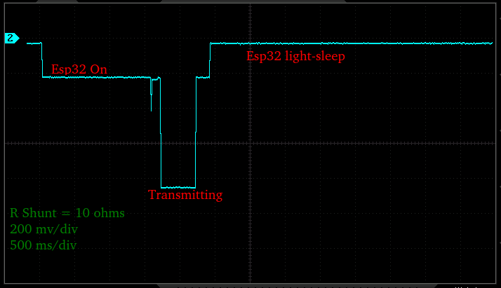
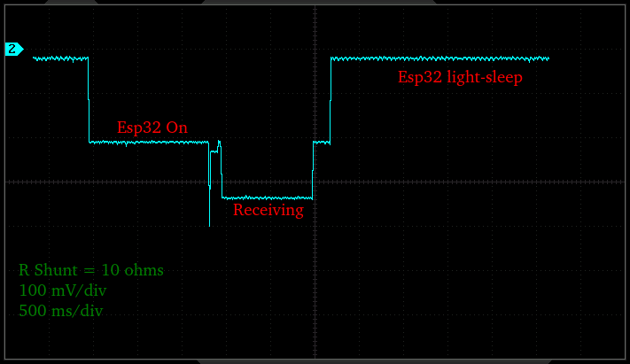

# **Relatório Técnico – Etapa 3 - Semana 2**  
## **Testes Funcionais Avançados**  
**Estação Meteorológica IoT – 02 a 08/12/2025**  
**Entrega:** 07/12 — **Reunião:** 15/12  
**Autores:** Antonio Crepaldi - Carlos Perez - Ricardo Furlan-

# **1. Introdução**

A Semana 2 da Etapa 3 teve como foco a execução de testes funcionais avançados para avaliar desempenho, tempo de resposta, estabilidade, consumo e robustez da comunicação da Estação Meteorológica IoT. Os testes desta fase permitem identificar gargalos, falhas de sincronismo e problemas de firmware ou hardware que só aparecem em operação contínua.

No entanto, o progresso foi parcialmente comprometido por atrasos na preparação de hardware crítico — especialmente o WCM (ESP32-C3 + RFM95W) — o que limitou a execução dos testes fim a fim com o TTN/ThinsBoard. Apesar disso, foram conduzidos os testes possíveis dentro do escopo atual, mantendo continuidade com a integração estabelecida na Semana 1.

Cabe ressaltar que, durante as próximas semanas, concomitante com a integração física das partes, deverão ser feitos os testes faltantes, efetivando as correções necessárias. sem comprometer o cronograma geral do projeto.

---

# **2. Metodologia de Testes**

### **2.1 Definição dos Casos de Teste**

Os casos de teste foram definidos com base na necessidade de avaliar o comportamento das partes do sistema já implementados em condições o mais próximo da realidade de operação, contornando as restrições já descritas. Os critérios para seleção incluíram:

* cobertura dos principais elementos do sistema (sensores, firmware, comunicação e energia);
* priorização de rotinas críticas para o funcionamento contínuo da estação;
* análise de pontos já identificados como sensíveis na Semana 1 desta etapa.

A matriz de cobertura contemplou:

* leitura dos sensores I²C,
* operação do GPS via UART,
* transmissão LoRa (ponto a ponto) e LoRaWAN (ainda pendente),
* montagem e envio do payload,
* ciclos de wake-up e consumo energético.

Com isso, foi preparado um **test plan** provisório contendo os testes de leitura, processamento, transmissão, latência, consumo, estabilidade do firmware e robustez da comunicação.

---

### **2.2 Ambiente e Ferramentas Utilizadas**

Os testes foram executados utilizando o hardware disponível até o momento:

* **BitDogLab (RP2040)** para leitura de sensores e montagem preliminar do pacote de telemetria;
* **WCM (ESP32-C3)** para testes iniciais do uplink LoRaWAN;
* **RFM95W** para validação da camada física LoRa.

A infraestrutura de rede foi composta por:

* servidor completo em Docker (ChirpStack),
* broker MQTT interno ao ChirpStack,
* simulador de gateway.

Foram utilizadas ferramentas auxiliares como multímetro, osciloscópio, interface serial para registro de comportamento. As versões do firmware foram registradas para rastreabilidade dos resultados obtidos.

---

### **2.3 Procedimentos**

Cada teste foi repetido diversas vezes para garantir consistência nos resultados, com repetição mínima de 5 ciclos por caso de teste. Os critérios de aceitação incluíram estabilidade da leitura, coerência do tempo de resposta e ausência de falhas inesperadas durante o ciclo completo.

---

# **3. Resultados dos Testes**

## **3.1 Desempenho Geral**
Assim que disponível o hardware faltante, o firmware necessário e a total integração do sistema, deverão ser efetivadas as seguintes medições:  
- Tempo médio de leitura de sensores:  
    - BMP280  
    - GPS  
    - Batery level  
- Tempo de processamento interno:  
    - Tempo para inicialização do sistemae carregamentoi da tela de configuração  
    - Tempo entre acordar, colher dados, montar o payload e enviar para transmissão  
    - Tempo de desativação de módulos para voltar a dormir  
    - Tempo total do ciclo completo  

## **3.2 Tempo de Resposta e Latência**

Assim que a comunicação LoRaWAN for integrada ao projeto, os seguintes dados de testes deverão ser obtidos para uma análise completa de desempenho:  
    - Tempo de envio do pacote via LoRaWAN → Servidor de rede.  
    - Análise de variabilidade (jitter).  

## **3.3 Estabilidade do Firmware**
Da mesma forma, com o sistema totalmente integrado, deverão ser observados os seguintes itens:  
    - Ocorrência de resets inesperados.  
    - Validação do funcionamento do watchdog.  
    - Ocorrência de leituras inconsistentes.  

## **3.4 Consumo de Energia**
Foram coletados, preliminarmente, ainda com o firmware em desenvolvimento, os seguintes valores de consumo de energia:  
* Raspberry Pi Pico:  
    - Corrente em simulação de deep sleep (clock reduzido): 1,7 mA
    - Corrente com clock default: 22 mA
* WCM (ESP32 + RFM95W): apenas com protocolo LoRa
    - ESP32-acordado (não transmitindo, nem recebendo  dados): 25 mA  
    - ESP32-acordado e recebendo dados: 35 mA  
    - ESP32-acordado e transmitindo dados: 90mA, com pouca alteração em diversas potências de transmissão 
    - ESP32 em light sleep: 0,5 mA  

Com a incorporação do firmware e tendo a estrutura de comunicação bem estabelecida, os seguintes consumos deverão ser ainda confirmados:  
* Corrente durante transmissão LoRaWAN.  
* Estimativa de autonomia diária baseada nas medições.  

## **3.5 Robustez da Comunicação**
Igualmente, os itens abaixo só poderão ser avaliadois assim que a nova versão de hardware e o novo firmware do WCM estiver pronta:  
    - Taxa de sucesso de pacotes.  
    - Pacotes não confirmados (quando aplicável).  
    - SNR e RSSI médios e extremos.  
    - Comportamento em paredes, distância e interferência.

---

# **4. Testes de Estresse**
Serão registrados aqui os testes pendentes que deverão ser levados a cabo quando da integração total do sistema:

## **4.1 Cenários-limite a Serem Aplicados**
- Transmissões repetidas com pouco intervalo.  
- Falhas induzidas (ex.: desconectar antena, reduzir bateria).  
- Ambiente com ruído eletromagnético.  

## **4.2 Comportamento a Ser Observado**
- Travamentos.  
- Degradação de desempenho.  
- Perda de pacotes.  
- Superaquecimento (se aplicável).  

---

# **5. Conclusão**

Mesmo sem muitos avanços nos testes de integração, pelos problemas já relatados acima, foram aplicados esforços em outros âmbitos com os recursos disponíveis:
* definição do payload de transmissão, essencial para a definição do ToA (Time on Air) e para apoiar a decodificação dos dados, além de influenciar no consumo de energia.  
* identificação dos principais gargalos de consumo de energia, gerando os pontos de atenção que deverão ser observados no desenrolar do projeto.
*  definição da estrutura básica do firmware da BitDogLab.
