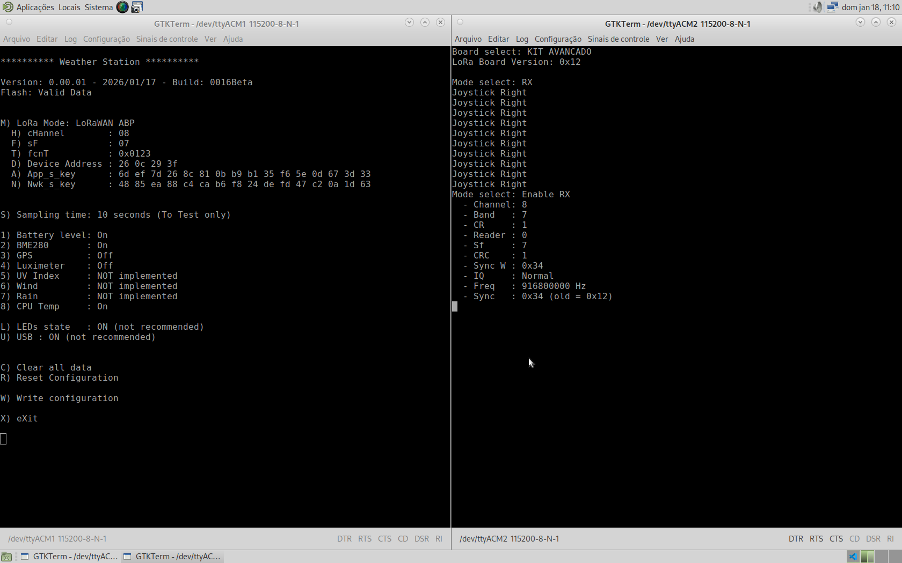
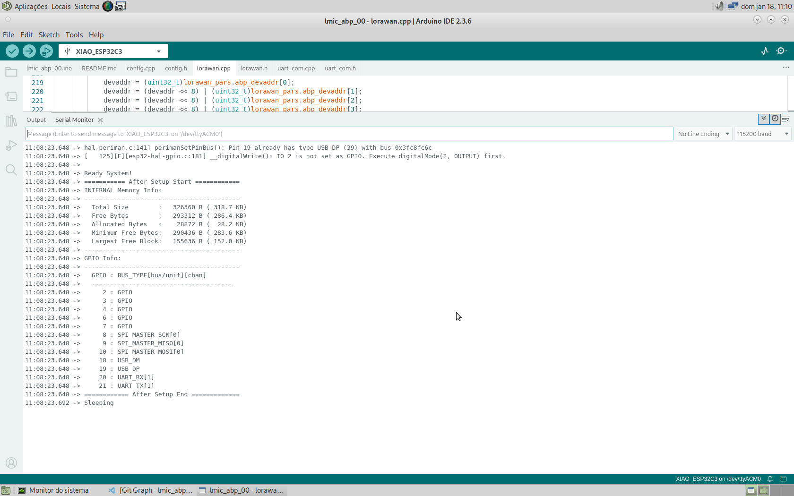
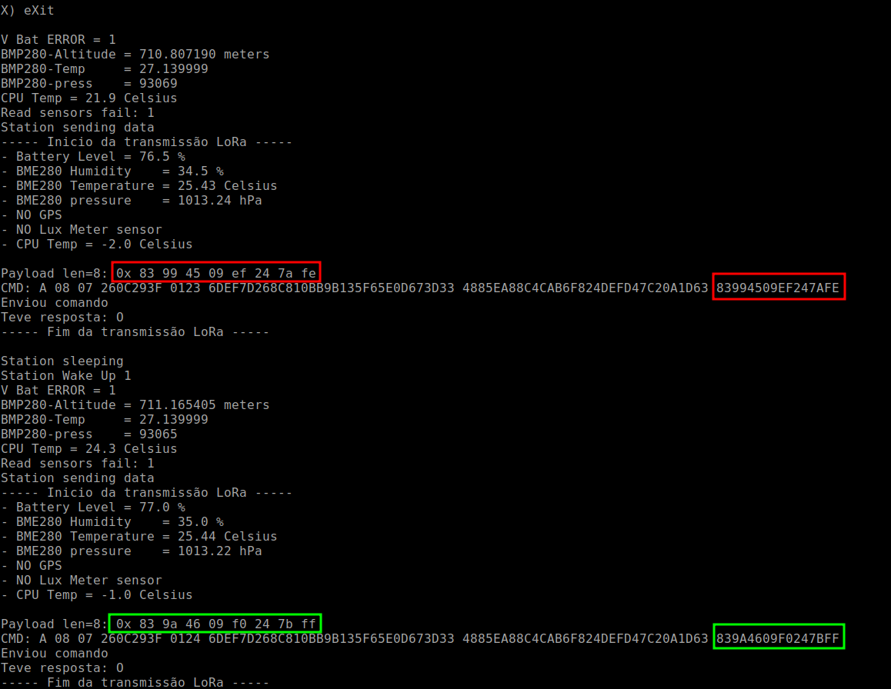
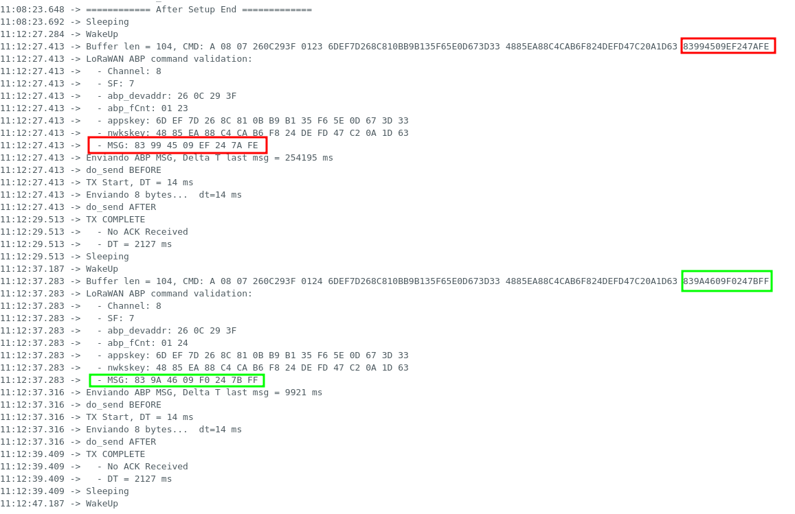

# Relatório Técnico – Etapa 4 – Semana 2
## Validação Externa Inicial e Ajustes do Sistema

**Projeto:** Estação Meteorológica IoT  
**Período:** 12 a 18 de janeiro de 2026  
**Autores:** Antonio Crepaldi – Carlos Perez – Ricardo Furlan  

---

## 1. Introdução

A Semana 2 da Etapa 4 tinha como objetivo principal a **validação externa inicial do sistema**, dando continuidade ao processo iniciado na Semana 1, que concentrou-se na validação técnica interna. Nesta fase, o objetivo foi submeter o protótipo da Estação Meteorológica IoT a **avaliação por usuários e avaliadores externos ao grupo**, visando coletar feedback técnico e funcional, identificar lacunas de uso real e promover ajustes incrementais no sistema.

---

## 2. Descrição do Processo de Validação Externa

A validação externa foi conduzida de forma controlada, com a apresentação do sistema a avaliadores externos (docentes, colegas de outros grupos e potenciais usuários técnicos), seguindo um roteiro previamente definido.

### 2.1 Escopo da Validação

Foram avaliados os seguintes aspectos do sistema:

- funcionamento geral do protótipo da estação;
- processo de aquisição de dados dos sensores;
- comportamento energético (conceitual);
- comunicação via LoRaWAN ABP (arquitetura e fluxo);
- facilidade de configuração e operação.

### 2.2 Metodologia

O processo consistiu em:

1. Demonstração do protótipo em funcionamento (leitura de sensores e transmissão);
2. Explicação do fluxo de dados até o backend;
3. Discussão aberta com os avaliadores;
4. Coleta de feedback verbal e anotações técnicas.

---

## 3. Feedback Recebido

O feedback coletado foi classificado em **técnico** e **funcional**, conforme descrito a seguir.

### 3.1 Feedback Técnico

- Questionamentos sobre a autonomia energética em períodos prolongados sem sol;
- Discussão sobre os motivos de simplificação do payloadde modo a reduzi-lo visando menor ToA (Tome on Air);
- Demonstração dos logs claros para depuração de falhas;
- Início dos testes reais com o gateway da FEEC.

### 3.2 Feedback Funcional

- Expectativa de dashboards com visão individual e comparativa entre estações;
- Necessidade de identificação simples do status da estação (online/offline);
- Importância de documentação para instalação, configuração e operação da estação.

Esse conjunto de feedback reforçou pontos já identificados internamente e trouxe novas prioridades sob a ótica do usuário final.

---

## 4. Ajustes Realizados no Sistema

Com base no feedback recebido, foram realizados ajustes iniciais e definidos novos ajustes.

### 4.1 Ajustes Técnicos

- Revisão da estrutura do payload para a adição de sensores;
- Inclusão de novas mensagens de log para erros do WCM (timeouT);
- Adição de novos sensores (luxímetro e temperatura interna do microntrolador);
- Implementação de novo data converter no TTN.

### 4.2 Ajustes Funcionais

- Definição de indicadores de status da estação;
- Organização preliminar da documentação técnica para usuários externos.

Esses ajustes visam melhorar a confiabilidade percebida e a usabilidade do sistema.

---

## 5. Evidências de Funcionamento

Foram coletadas como evidências os logs da BitDogLab, do WCM e do simulador de Gateway:

### Log Inicial
**BitDogLab e Gateway (simulado)**

**WCM**

### Log após duas transmissões
- Em vermelho os dados da primeira transmissão
- Em verde os dados da segunda transmissão

**BitDogLab**

**WCM**

**Gateway (simulado)**

---

## 6. Avaliação de Aderência à Proposta de Valor

A proposta de valor do projeto consiste em oferecer uma **estação meteorológica de baixo consumo, escalável, baseada em LoRaWAN e integrada a dashboards modernos**, adequada para monitoramento ambiental distribuído.

Com base na validação externa, observou-se que:

- a arquitetura escolhida é adequada ao cenário proposto;
- a solução atende às necessidades básicas de monitoramento ambiental;
- a escalabilidade para múltiplas estações é viável;
- os principais pontos de melhoria concentram-se na apresentação dos dados, na autonomia energética e na robustez.

Assim, conclui-se que o sistema apresenta **boa aderência à proposta de valor**, com ajustes incrementais ainda necessários para operação contínua.

---

## 7. TRL Atualizado e Justificativa

Após a realização da validação externa inicial, o projeto apresenta:

- protótipo funcional;
- validação técnica interna concluída;
- primeira rodada de validação externa;
- feedback real incorporado ao desenvolvimento.

Dessa forma, considera-se que o projeto evoluiu para o **TRL 5**:

A consolidação em **TRL 6** dependerá da implantação em campo com operação contínua e coleta de dados reais por período prolongado.

---

## 8. Conclusão

A Semana 2 da Etapa 4 representou um avanço importante na maturidade do projeto, ao expor o sistema à avaliação externa e incorporar feedback real ao processo de desenvolvimento.

Os resultados obtidos confirmam a viabilidade da solução proposta e indicam caminhos claros para os próximos passos, que incluem a validação em campo, aprimoramento dos dashboards e consolidação da documentação, preparando o sistema para uma operação mais próxima do cenário final.
