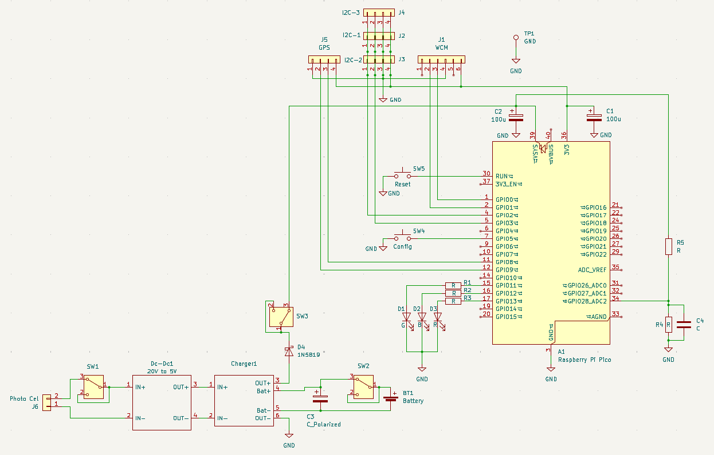
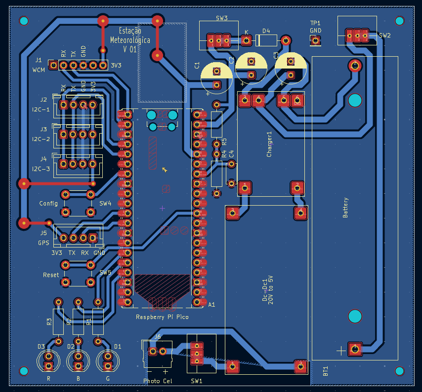
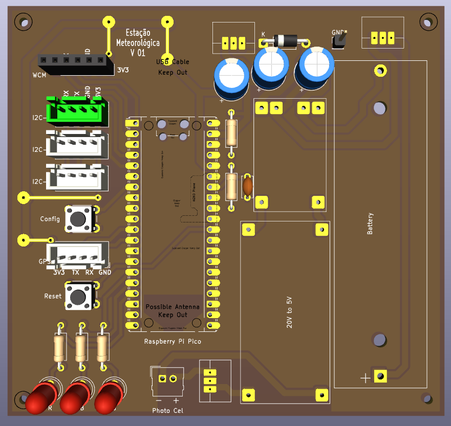

# Relatório Técnico – Etapa 4 – Semana 3
## Consolidação da Documentação e Preparação Final do Protótipo

**Projeto:** Estação Meteorológica IoT  
**Período:** 19 a 25 de janeiro de 2026  
**Autores:** Antonio Crepaldi – Carlos Perez – Ricardo Furlan  

---

## 1. Introdução

A Semana 3 da Etapa 4 teve como objetivo a **consolidação final da documentação técnica do projeto**. Entretanto, dada a reorganização do hardware do projeto, detalhado mais à frente neste relatório, o grupo concentrou-se nessas atividades, visto que a documentação de instalação, configuração e operação da estação já teve sua estrutura praticamente consolidada na Fase 2 do programa Embarcatech.

---

## 2. Aspectos Abordados na Semana

As atividades dessa semana foram:  

- testes de validação da comunicação LoRaWAN junto ao Gateway e The Things Network (TTN);
- testes de carga de bateria com painel solar;
- desenvolvimento de novo hardware: definição de esquemático, layout e confecção da PCB do protótipo.

### 2.1 Testes de Validação LoRaWAN

Os testes de validação de LoRaWAN foram executados no laboratório da FEEC, junto ao Gateway e, usando o hardware previamente preparado com a BitDogLab, foi possível fazer chegar ao TTN o payload projetado com dados de bateria, temperatura e pressão.

### 2.2 Testes de Carregamento da Bateria

Foi verificada a possibilidade de carga da bateria da estação em dias nublados, garantindo a autonomia desejada. Além disso, várias condições de tensão que excedem as geradas pela placa solar foram testadas e aprovadas.

### 2.3 Desenvolvimento de novo hardware

A placa BitDogLab, em sua versão 7, carrega periféricos nativos, tais como, joystick, matriz de led, regulador de tensão, microfone e amplificador de áudio, display oled e buzzer, que não são necessários no projeto da estação meteorológica. Além disso, estes periféricos, mesmo não sendo utilizados, consomem energia, reduzindo significativamente a autonomia da estação.  
Assim, para mitigar essa condição indesejável, é necessário executar um grande retrabalho na placa, alterando seu propósito educacional. Nesse contexto, foi decidido pelo grupo a confecção de uma placa dedicada exclusivamente ao projeto da estação. Essa nova placa de face única, de tamanho compatível com a BitDogLab, consiste de Raspberry Pi Pico, regulador de tensão, carregador de bateria, bateria, chaves de operação e conectores para os sensores e a WCM, responsável pela comunicação LoRaWAN.  

---

## 3. Diagramas Atualizados

Como parte da consolidação, foram revisados e atualizados os seguintes diagramas:

- diagrama de arquitetura geral do sistema;

- esquemático da estação;

- layout da placa de circuito impresso.

Esses diagramas refletem o estado atual do projeto e servem como apoio visual para entendimento rápido do sistema.

---

## 4. Organização e Versionamento do Repositório

O repositório do projeto está organizado visando clareza e manutenibilidade, com:

- separação clara entre firmware (Code), hardware e documentação (Docs);

- padronização de nomes de arquivos e pastas;

- inclusão de arquivos README explicativos.

---

## 5. Conclusão

A Semana 3 da Etapa 4 marcou um ponto de virada (turnning point), dado que foi resolvido pelo grupo a execução de uma placa consolidando todos os requisitos da estação, substituindo a BitDogLab. Isso se deveu ao fato de que os periféricos nativos da BitDogLab têm prioridade educacional. A prioridade da estação, por outro lado, é a autonomia energética.   
Assim, a próxima semana será de trabalho intenso para a montagem mecânica e instalação em campo do protótipo com a nova PCB.
