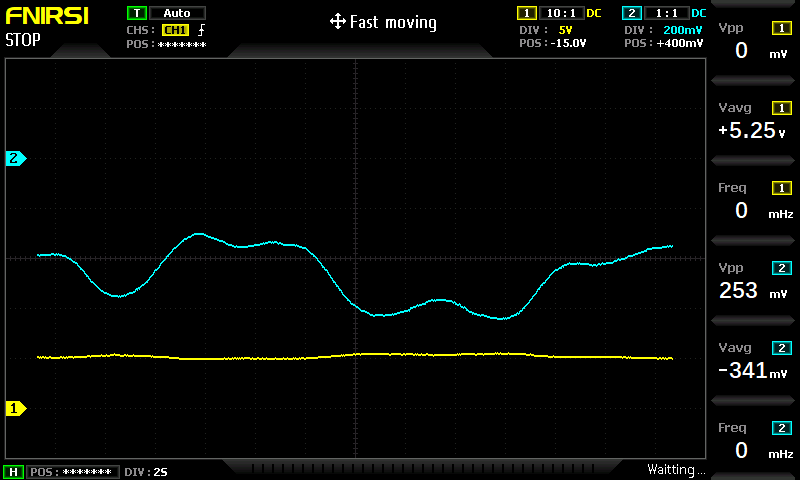
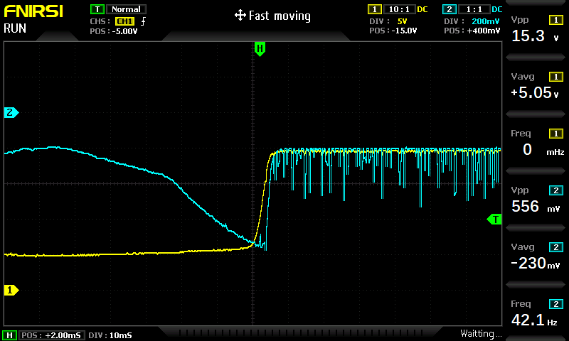
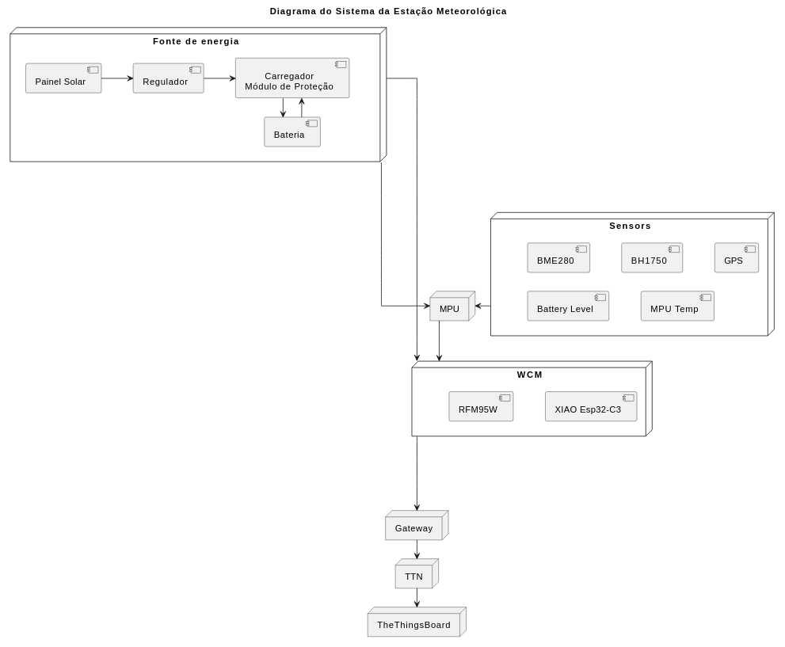
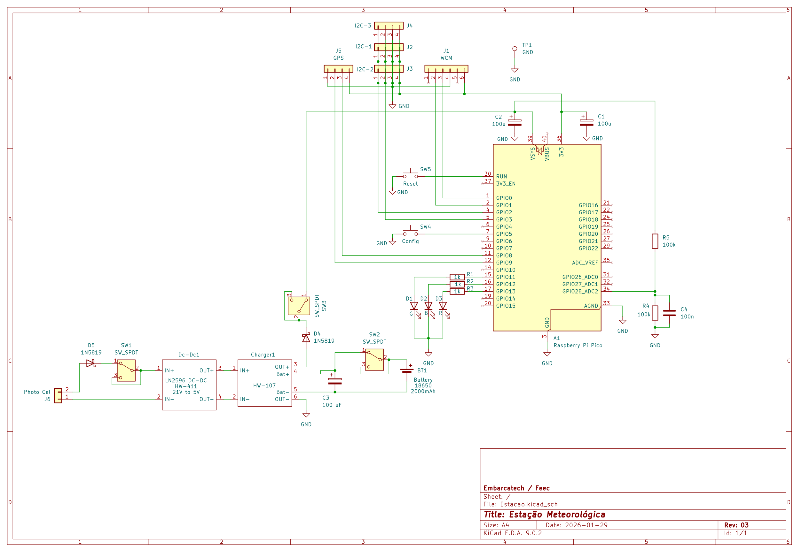
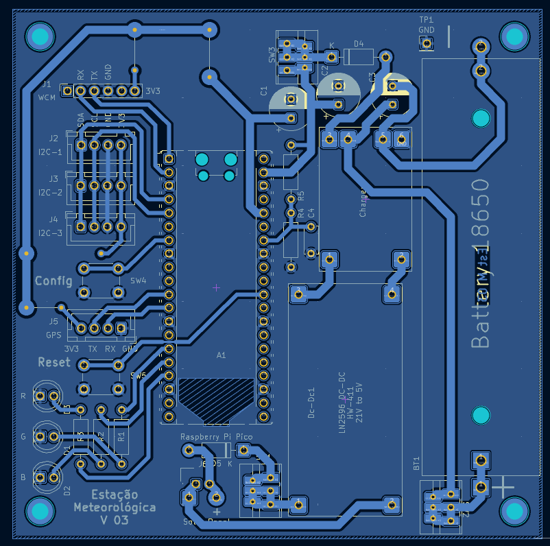

# Relatório Técnico – Etapa 4 – Entrega Final da Etapa

## Consolidação, Validação e Pré-Entrega do Protótipo

**Projeto:** Estação Meteorológica IoT  
**Período:** 5 a 31 de janeiro de 2026  
**Autores:** Antonio Crepaldi – Carlos Perez – Ricardo Furlan  

---

## 1. Introdução

A Etapa 4 do projeto teve como objetivo principal a **validação do protótipo em condições próximas ao uso real**, bem como a **consolidação técnica e documental da solução**, preparando o sistema para a entrega final do programa Embarcatech.

Ao longo desta etapa, o grupo evoluiu desde a validação técnica interna (Semana 1), passando pela validação externa inicial (Semana 2), revisão da documentação e do hardware (Semana 3), culminando nesta entrega, que sintetiza os resultados obtidos na revisaõ de hardware do protótipo capaz de coletar dados e enviá-los, através de um gateway LoRaWAN, a um servido de rede (TTN).  

---

## 2. Visão Geral do Sistema Pré Consolidado

O sistema desenvolvido consiste em uma **estação meteorológica IoT de baixo consumo energético**, projetada para operação distribuída no campus da Unicamp, com comunicação via **LoRaWAN**, integração com **The Things Network (TTN)** e visualização de dados em **ThingsBoard**. A entrega final do projeto prevê a instalação de 10 unidades da estação meteorológica, cada uma montada em uma caixa hermética que abriga e sustenta a placa principal e os sensores ambientais, anexada a uma placa solar sustentada por um suporte articulável, em diferentes locais do campus.  

### 2.1 Funcionalidades Implementadas

* Medição de temperatura, pressão atmosférica e umidade relativa (BME280);
* Medição do nível de carga da bateria;
* Medição da intensidade luminosa (BH1750);
* Monitoramento da temperatura interna do MPU;
* Aquisição de dados de posição (GPS);
* Comunicação LoRaWAN com payload otimizado;
* Estratégias de redução de consumo energético (sleep mode);
* Arquitetura modular para adição de novos sensores;
* Backend preparado para múltiplas estações.

---

## 3. Processo de Validação da Etapa 4

### 3.1 Validação Técnica Interna

Na Semana 1, foram validados individualmente os principais blocos do sistema, incluindo aquisição de dados, comunicação LoRaWAN, gerenciamento energético e organização do firmware. Esses testes permitiram confirmar o correto funcionamento dos subsistemas antes da exposição externa do protótipo.

### 3.2 Validação Externa Inicial

Na Semana 2, o sistema foi apresentado a avaliadores externos (docentes, colegas de outros grupos e usuários técnicos), seguindo um roteiro estruturado de demonstração e discussão. O foco foi avaliar:

* clareza da arquitetura;
* viabilidade da solução proposta;
* facilidade de operação;
* percepção de valor para monitoramento ambiental distribuído.

O feedback coletado foi utilizado para ajustes técnicos e funcionais, descritos nas seções seguintes.

### 3.3 Testes Integrados e Consolidação

Na Semana 3, foram realizados testes integrados com o gateway da FEEC e TTN, além de testes de carregamento da bateria via painel solar. Paralelamente, foi conduzido o redesenho do hardware, culminando na criação de uma PCB dedicada ao projeto.  

---

## 4. Ajustes e Evoluções Realizadas

### 4.1 Ajustes Técnicos

* Otimização do payload LoRaWAN para redução do Time on Air (ToA);
* Inclusão de novos logs para diagnóstico de falhas;
* Revisão do gerenciamento energético;
* Migração do protótipo da BitDogLab para uma placa dedicada, eliminando periféricos desnecessários e reduzindo expressivamente o consumo e o custo;
* Atualização do data converter no TTN.

### 4.2 Ajustes Funcionais

* Definição de indicadores de status da estação;
* Organização do manual do protótipo (instalação, configuração e operação).

---

## 5. Evidências de Funcionamento

Como evidências do funcionamento do sistema, foram obtidos:

* logs da estação durante transmissões LoRaWAN;

* registros de recepção pelo simulador de gateway;

* testes de carga da bateria via painel solar;
	- Corrente do painel com pouca iluminação

	- Corrente do painel quando adiquire ilumção suficiente para plena carga.

* diagramas atualizados de arquitetura, esquemático e layout da PCB;
	- Diagrama

	- Esquemático

	- PCB

* planejamento inicial do repositório versionado.

---

## 6. TRL Final da Etapa 4 (Pré-Entrega)

Considerando:

* protótipo funcional e integrado;
* validação técnica interna concluída;
* validação externa inicial realizada;
* ajustes incorporados ao sistema;
* documentação consolidada;
* testes reais de comunicação e energia;

o projeto atinge ao final da Etapa 4 o **TRL 5 – Tecnologia validada em ambiente relevante**.

A evolução para **TRL 6** dependerá da instalação contínua em campo, operação prolongada e coleta sistemática de dados reais em múltiplas estações.

---

## 7. Conclusão Geral da Etapa 4

A Etapa 4 consolidou o projeto da Estação Meteorológica IoT como uma solução tecnicamente viável, coerente com sua proposta de valor e pronta para implantação controlada.

Os resultados obtidos demonstram maturidade crescente do sistema, clareza arquitetural e alinhamento entre hardware, firmware e backend. A entrega desta etapa encerra o ciclo de validação inicial e prepara o projeto para fases futuras de operação em campo e escalonamento.  
