# RELATÓRIO FINAL DO PROJETO

# Estação Meteorológica IoT de Baixo Consumo com LoRaWAN

**Autores: Antonio Crepaldi - Carlos Perez - Ricardo Furlan**

**15/02/2026**

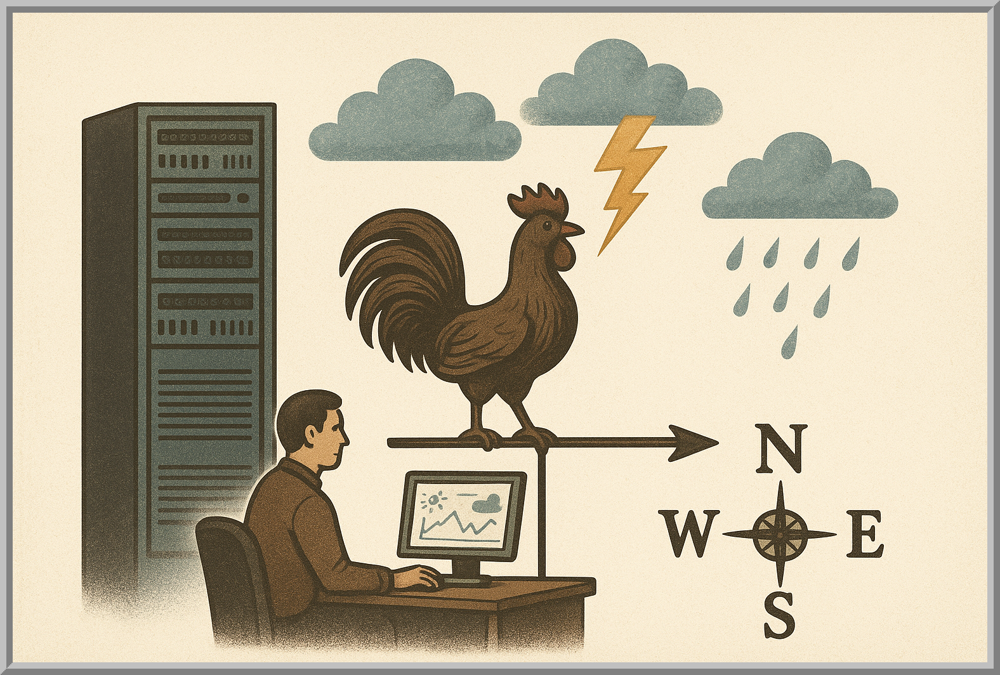
---

## 1. Introdução

Este relatório apresenta a consolidação final do projeto **Estação
Meteorológica IoT**, desenvolvido no âmbito do programa Embarcatech, com
foco em:

- Monitoramento ambiental distribuído;
- Comunicação via LoRaWAN;
- Autonomia energética com painel solar;
- Visualização em dashboards dos dados coletados;
- Solução escalável para múltiplas estações.

O projeto evoluiu desde validações laboratoriais (TRL 4) até validação
em ambiente operacional (TRL 7), culminando na implantação em
campo e validação integral do sistema.  
A figura a seguir, apresenta a estação operando em campo.

---

## 2. Requisitos do Projeto

O projeto atende ao que foi solicitado no Programa Embarcatech em sua fase 3. Os requisitos consolidados do projeto são os seguintes:  

### 2.1 Requisitos Funcionais

O sistema deverá ser capaz de executar as seguintes medições de parâmetros ambientais:  
- Temperatura do Ar: medição em graus Celsius (°C)
- Umidade Relativa do Ar: medição em porcentagem (%)
- Pressão Atmosférica: medição em hecto Pascal (hPa)
- Luminosidade: medição em Lux (lx)
- Localização: obtenção de coordenadas geográficas
- Tensão da bateria: medição em Volts (V)

Coleta de Dados:  
- Realizar a coleta de dados dos sensores habilitados em intervalos definidos (ex: a cada 1 minuto, 10 minutos, etc.).

Transmissão de Dados:  
- Transmitir os dados coletados via LoRaWAN para o gateway RAK7289V2 instalado na FEEC.  

Visualização e Análise de Dados:  
- Os dados serão acessíveis e visualizáveis através da plataforma TheThingsBoard, com dashboards personalizáveis e específicos.  

### 2.2 Requisitos Não Funcionais

- Modularidade: O design do sistema é modular, permitindo a fácil adição ou substituição de sensores para satisfazer às necessidades específicas de cada usuário.  
- Escalabilidade: O sistema é capaz de suportar a implantação de múltiplas estações em diferentes locais, de forma que os dados possam ser facilmente agrupados.
- Autonomia Energética: Operação autônoma com baixo consumo de energia, através de bateria de Lítio e carregamento com placa solar.
- Robustez Física e Resistência à Intempéries: O encapsulamento eletromecânico é resistente a condições climáticas adversas (chuva, vento, sol, poeira, umidade) atendendo ao grau de proteção IP68.
- Manutenibilidade: Facilidade de manutenção e atualização de software e hardware em campo.
- Segurança (Básica): Proteção básica dos dados transmitidos para o gateway, suprido pelo protocolo LoRaWAN.

---

## 3. Arquitetura Geral do Sistema

A figura a seguir, mostra a arquitetura geral do sistema, destacando os blocos de energia, sensores e comunicação.  
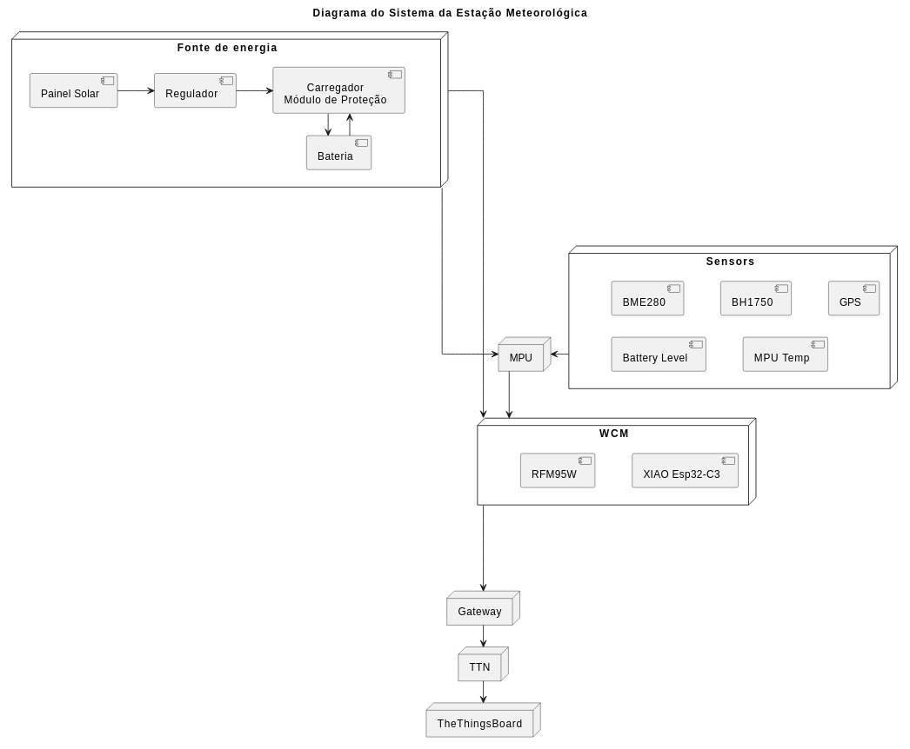

O sistema é composto por cinco camadas principais:

### 3.1 Camada de Sensoriamento

A implementação consta dos seguintes sensores:  
- Temperatura, umidade e pressão atmosférica (BME280);

| 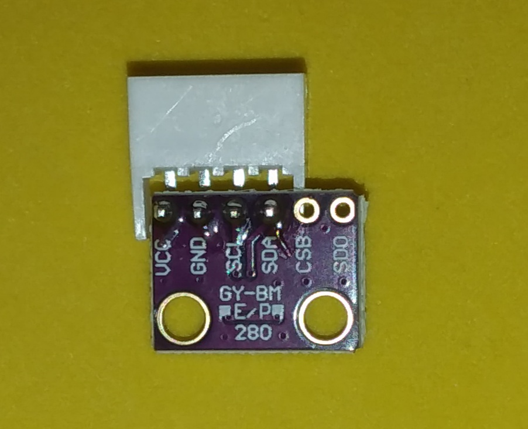 | 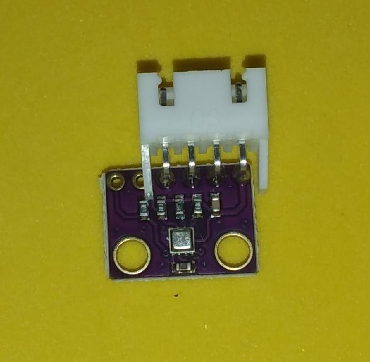 |
|------------------|------------------|  

- Luminosidade (BH1750);

| 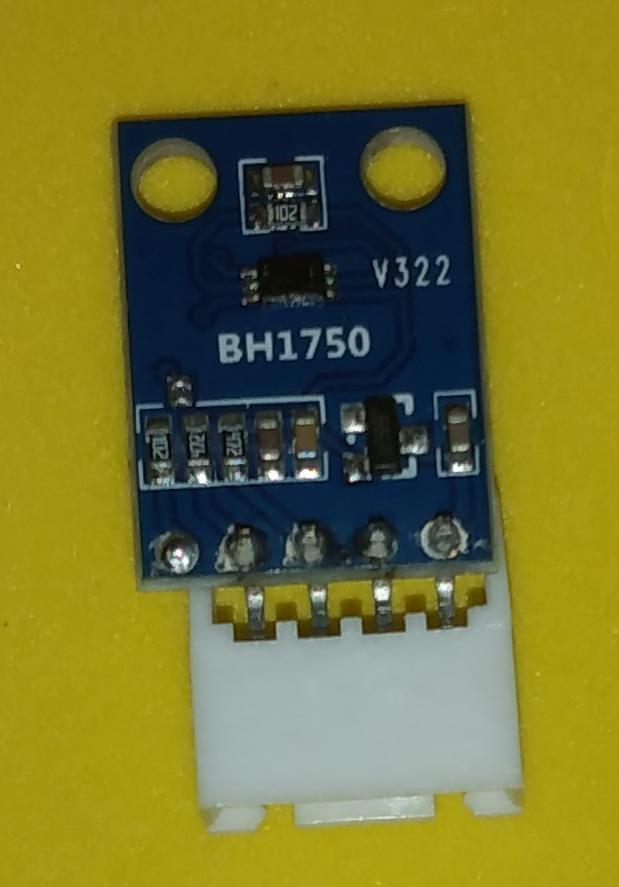 | 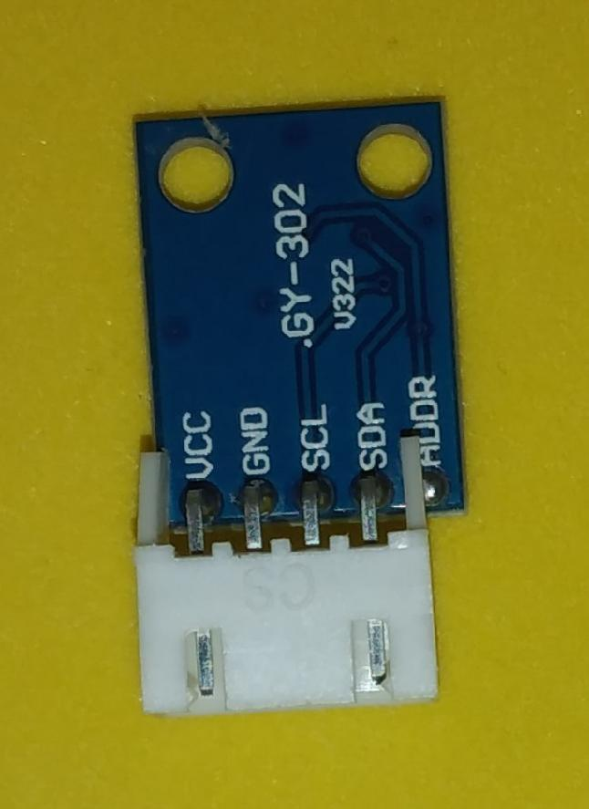 |
|------------------|------------------|  

- GPS (GY-NEO6MV2);

| 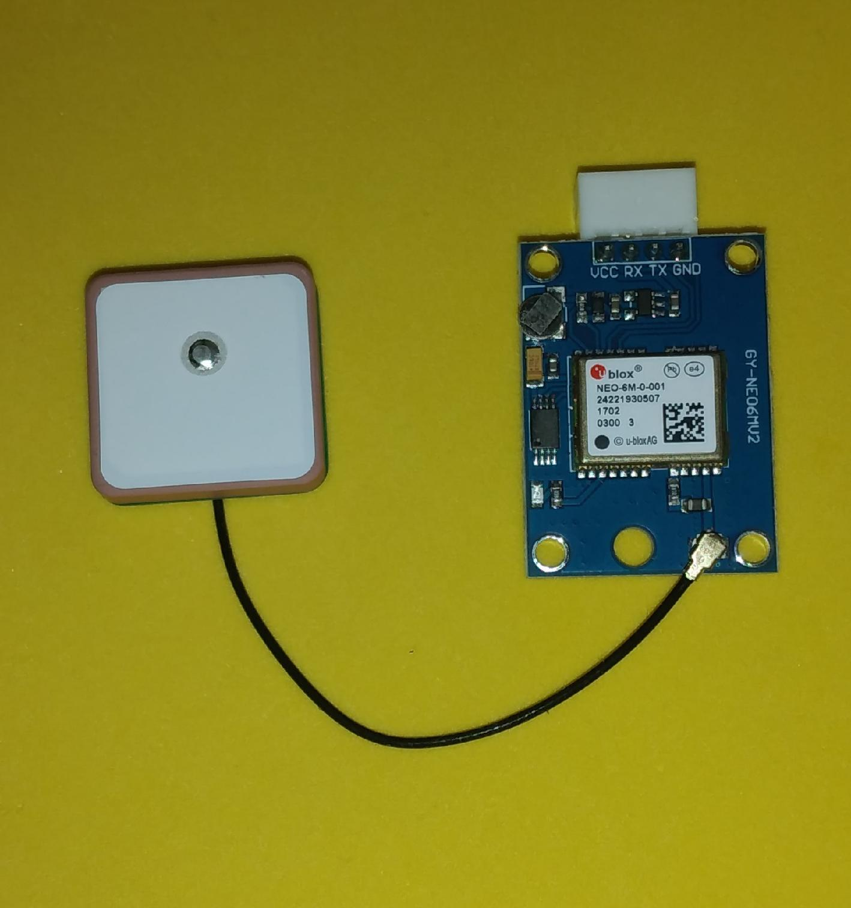 | 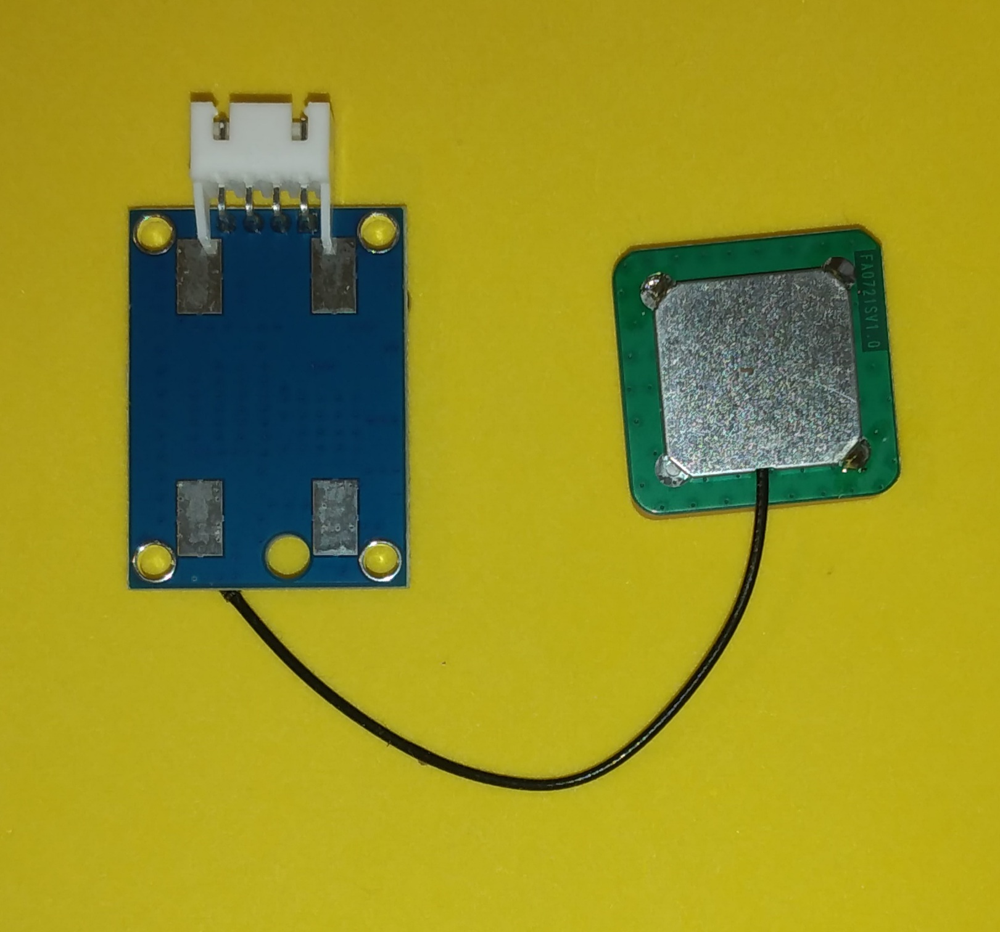 |
|------------------|------------------|

- Nível de bateria (via AD e divisor resistivo);
- Temperatura interna do microcontrolador (RP2040).

### 3.2 Camada de Processamento

A camada de processamento é composta pelos seguintes elementos:

-   Microcontrolador RP2040 (Raspberry Pi Pico);
-   Estratégias de baixo consumo (desativação de funcionalidades desnecessárias e redução de clock do micricintrolador);
-   Estrutura modular do firmware.

A figura a seguir mostra a disposição dos componentes na placa.  

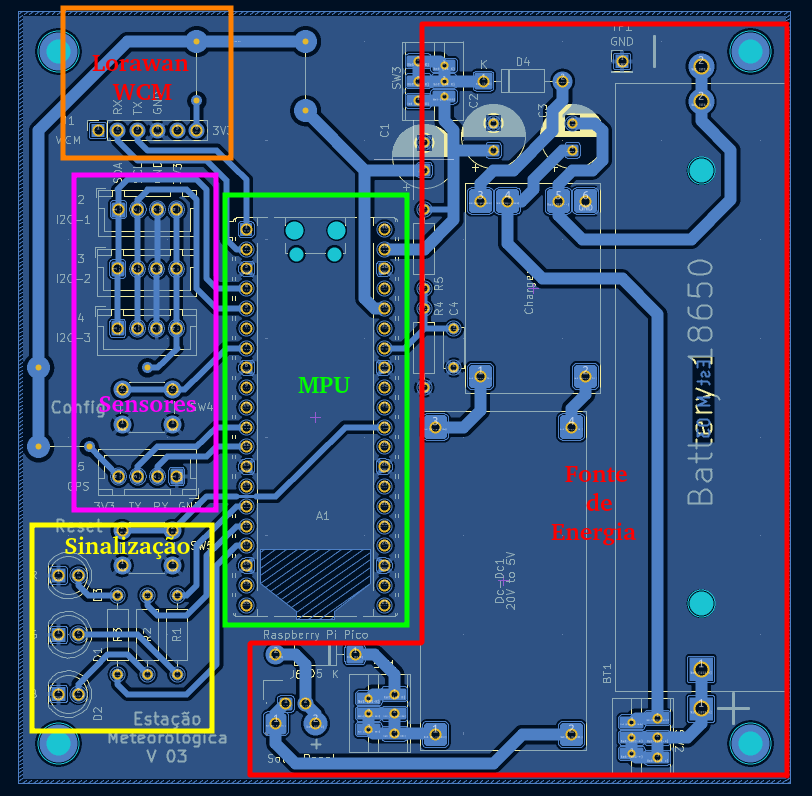

### 3.3 Camada de Comunicação

A camada de comunicação é constituída por:  
-   Módulo WCM - Wireless Communication Module (XIAO ESP32-C3 e RFM95W);
-  Implementação de Lite Sleep Mode;
-  Protocolo de comunicação LoRaWAN ABP;
-   Payload otimizado para redução do Time on Air (ToA).

Na figura a seguir aparece o WCM.

| 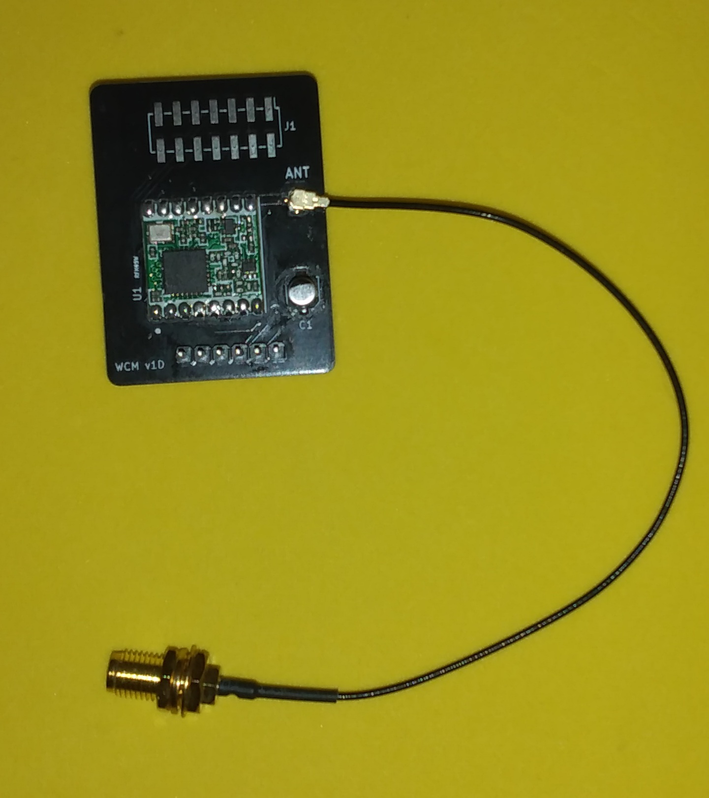 | 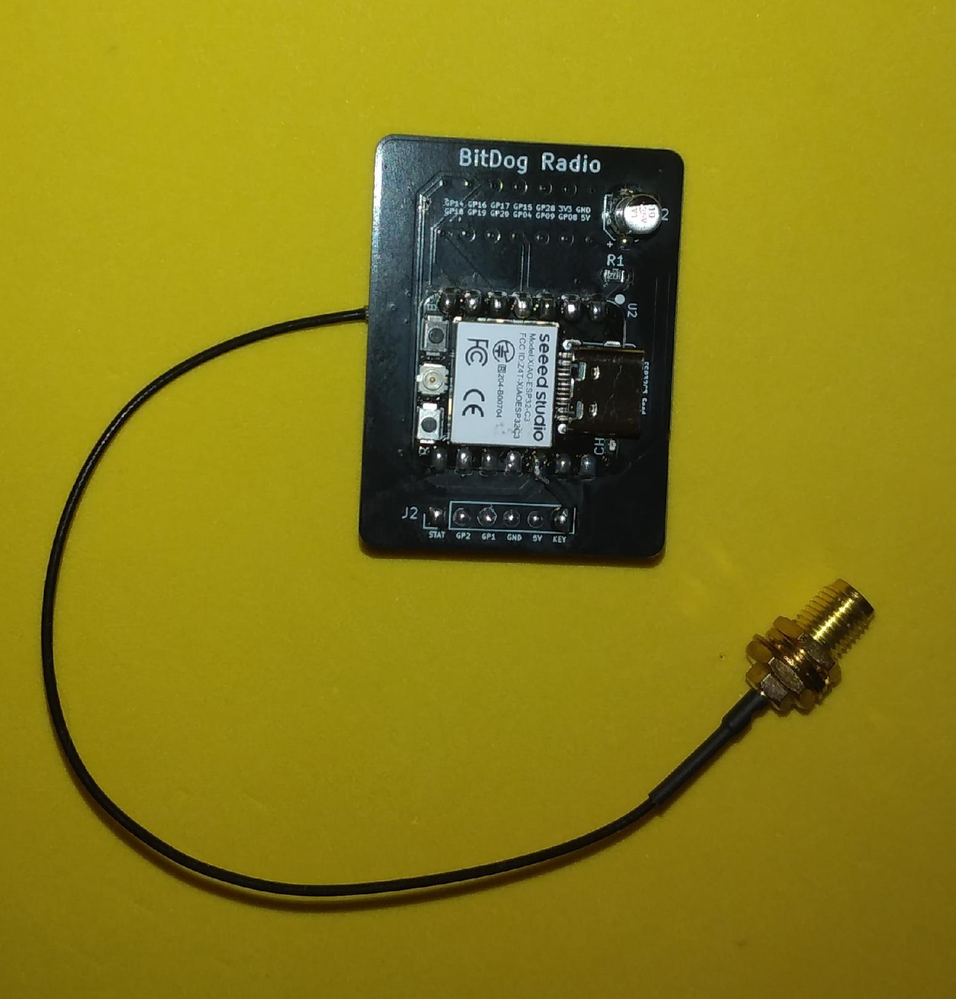 |
|------------------|------------------|

O hardware do módulo WCM foi desenvolvido no projeto de iniciação científica da FEEC (https://drive.google.com/file/d/10zEuYUwZnq1ES-jrfOPs1fpPD2277zWO/view).

### 3.4 Camada de Recepção de Dados

A camada de recepção de dados é constituída por:  
-  Gateway RAK7289V2;
-  Servidor na nuvem (The Things Network - TTN).

A camada de recepção de dados foi desenvolvida no projeto de iniciação científica da FEEC (https://docs.google.com/document/d/1o25VC49TM4YPC_RLyG_XDTTJo1DXNHsViMWomo7teZQ/edit?tab=t.hv56jkize0mv#heading=h.io2alehklfxd).

### 3.5 Camada de Aplicação

A camada de aplicação envolve:  
-  Servidor local (Raspberry Pi 5);
-  Persistência de dados com PostgreSQL.
-  TheThingsBoard com dashboards individuais e comparativos;
-  Acesso via Cloudflare.

Esta camada também foi desenvolvida pelo grupo de iniciação científica da FEEC.

---

## 4. Evolução Técnica do Projeto

### 4.1 Desenvolvimento Individual dos Componentes

Foram desenvolvidos individualmente:  
-  Software para aquisição de dados dos sensores (em anexo);
-  Software para comunicação LoRa ponto a ponto com RFM95W (em anexo);
-  Estratégias de redução de consumo para RP2040 e ESP32-C3;
-  Estratégias de carregamento de bateria com placa solar.

### 4.2 Integração dos Componentes do Sistema

-  Desenvolvimento da PCB dedicada (em anexo):  
O desenvolvimento inicial da estação meteorológica previa o uso da placa educacional BitDogLab versão 7. No decorrer do desenvolvimento, devido aos rigorosos requisitos de consumo de energia, optou-se pelo desenvolvimento de uma nova placa dedicada. Isto deveu-se ao fato de que os diversos periféricos da BitDogLab, ou seja, display OLED, matriz de LEDs RGB, microfone e amplificador de áudio e regulador 3V3, consumiam energia mesmo não estando em operação. Além disso, o carregador não energizava a placa automaticamente. Outro aspecto que corrobora com essa decisão é a necessidade de utilização de carregamento de bateria via placa solar, através da utilização de um carregador dedicado. Assim, foi desenvolvida uma nova PCB agregando todas os componentes, (RP2040, carregador de bateria, regulador de tensão, bateria, chaves de comando e conectores para os sensores e WCM), como mostra a figura a seguir.  

| 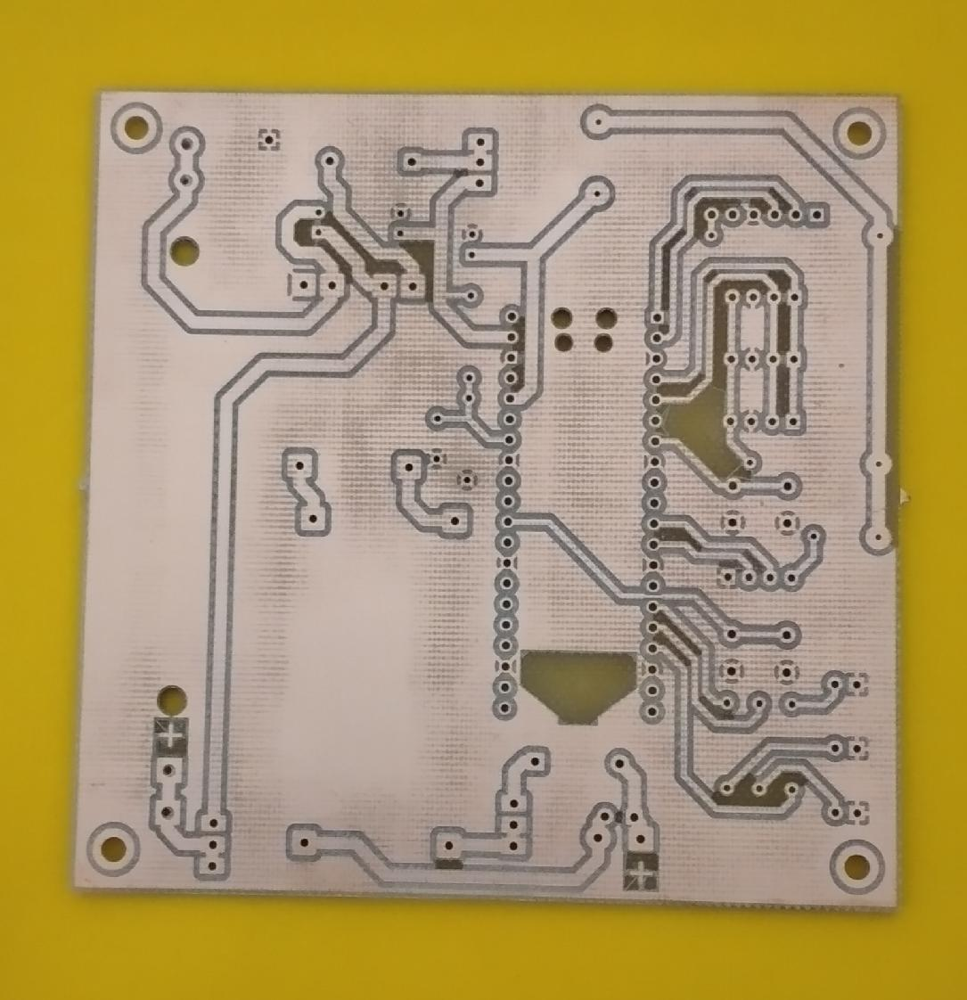 | 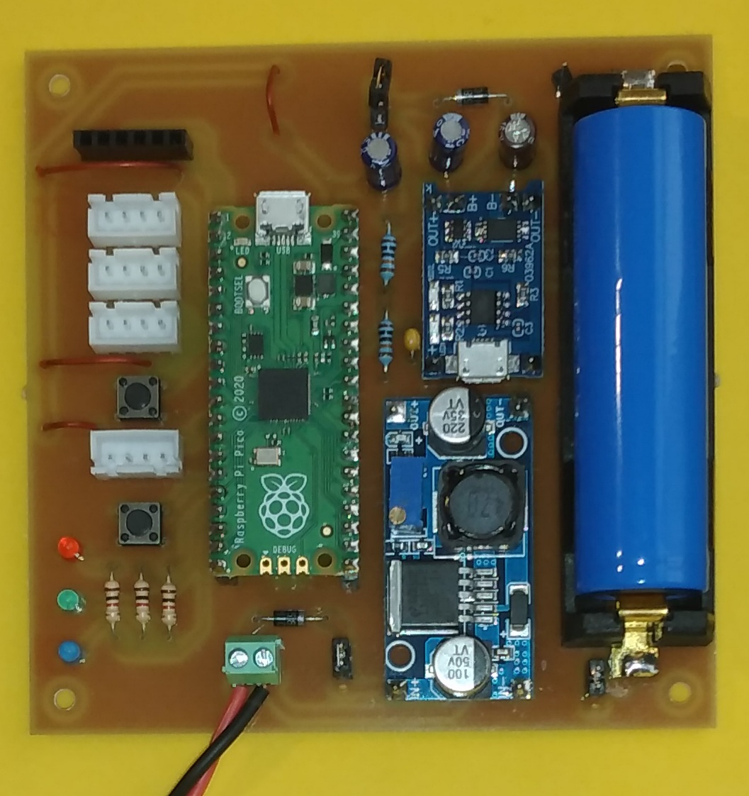 |
|------------------|------------------|

-  Firmware da estação (em anexo):  
O firmware da estação meteorológica tem duas seções principais:  
    - Interface de usuário, para configuração da estação e inicialização do sistema:  
A interface de usuário, com a configuração inicial do sistema, utiliza um menu intuitivo e de fácil navegação, através da utilização de um monitor serial via USB. Durante a operação normal, esta seção pode ser reacionada através do reset do sistema e do pressionamento do botão de configuração. Além disso, foram utilizados LEDs coloridos para indicar ao usuário os vários estados de funcionamento, ou seja, configuração, aquisição, comunicação, sleep mode e indicação de falhas de funcionamento.  
    - Loop para aquisição e comunicação dos dados climáticos coletados:  
O loop de operação da estação foi desenvolvido com uma estrutura modular de programação. A aquisição de dados pelos sensores, por exemplo, foi pensada para utilizar drivers que funcionam com uma estratégia comum de operação, ou seja, energizar o sensor, inicializar a aquisição, obter as medições das grandezas e, finalmente, colocar o sensor em sleep mode. Outro exemplo é a rotina responsável pela comunicação com o WCM, que pode ser editada para se comunicar com modelos futuros.  
Para atender aos requisitos de baixo consumo de energia, o firmware da estação, nos períodos em que ela não está coletando ou comunicando dados, foi projetado para simular um sleep mode via software, através da diminuição da frequência do clock principal e do desligamento dos PLLs, entre outras ações.  
O repositório do projeto (em anexo) descreve o firmware em detalhes.  

-  Firmware do WCM:  
O módulo WCM acorda assim que recebe uma comunicação via UART. Em seguida, recebe um comando para efetuar a comunicação e o payload com os dados a serem transmitidos e, assim que transmitir, volta a dormir, economizando energia.  

- Estrutura mecânica da estação:  
Para sua instalação em campo, a estação meteorológica conta com um suporte que sustenta a caixa com a placa principal, a placa solar e os sensores. Esse suporte, impresso em 3D, utilizando filamentos ABS, é acoplado á uma estrutura metálica fixada ao solo. Ele permite o correto posicionamento da placa solar para obter a máxima eficiência de insolação. Adicionamente, a placa solar funciona como abrigo à caixa do sistema.  

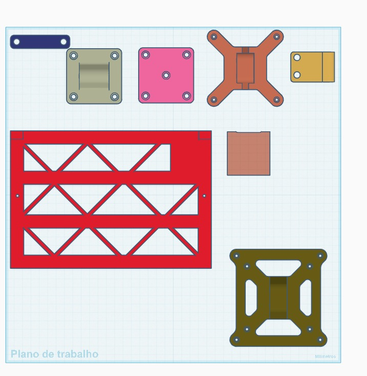

### 4.3 Construção e Montagem de Protótipos

Principais atividades realizadas:  
-   Montagem física de protótipos;
-   Correção do layout da PCB;
-   Substituição de componentes defeituosos;
-   Testes elétricos e funcionais;
-   Instalação física do primeiro protótipo em campo;
-   Mapeamento do sinal LoRaWAN em diversos pontos do campus (em anexo).  

### 4.4 Instalação Distribuída
-   Definição dos locais para instalação das unidades;
-   Instalação física das estações;
-   Verificação de funcionamento pós-instalação.

### 4.5 Backend e Dashboards
-   Verificação de chegada de dados no Gateway, TTN e TheThingsBoard;
-   Constatação de persistência e histórico;
-   Criação de dashboards.

### 4.6 Repositório Open Source
-   Criação de repositório exclusivo do projeto;
-   Organização de diretórios firmware, hardware e documentação.

---

## 5. Validação Final Integrada

Nesta seção são mostradas evidências do funcionamento do sistema.  

### 5.1 Evidência de Comunicação
 
- Dados obtidos durante o desenvolvimento simulando o gateway:  
    - A figura a seguir mostra o log da estação ao enviar dados ao WCM.
	

    - A figura a seguir mostra a recepção dos dados pelo simulador de gateway.
	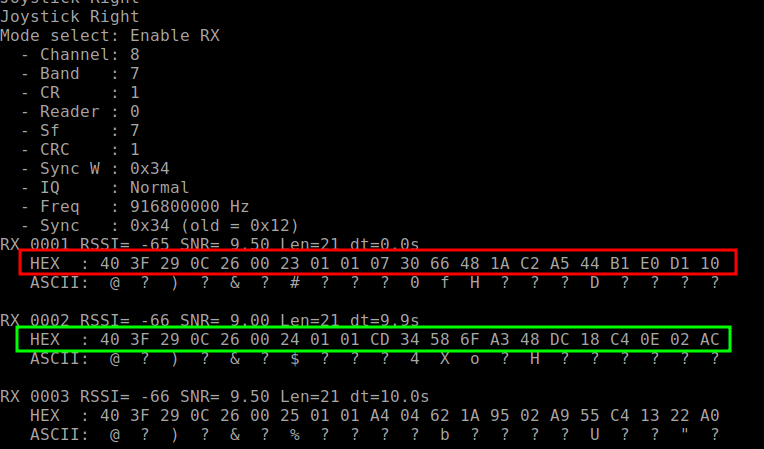

- A figura a seguir nostra os dados reais chegando ao gateway.
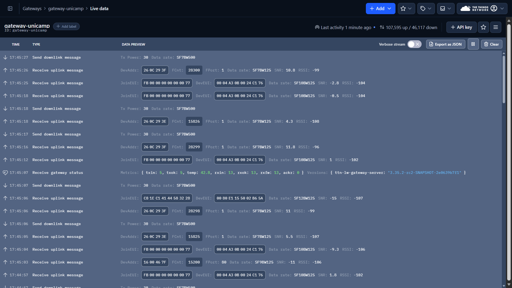

- A figura a seguir nostra os dados reais chegando ao TTN e a decodificação do payload.  
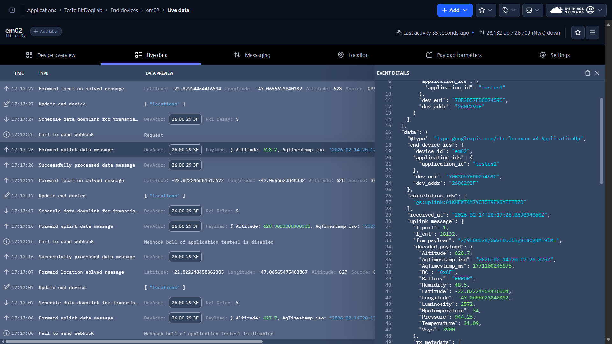

### 5.2 Evidencia de Autonomia Energética

- As figuras a seguir  mostram os estudos iniciais para avaliar o consumo do módulo WCM.  
	+ WCM transmitindo dados  
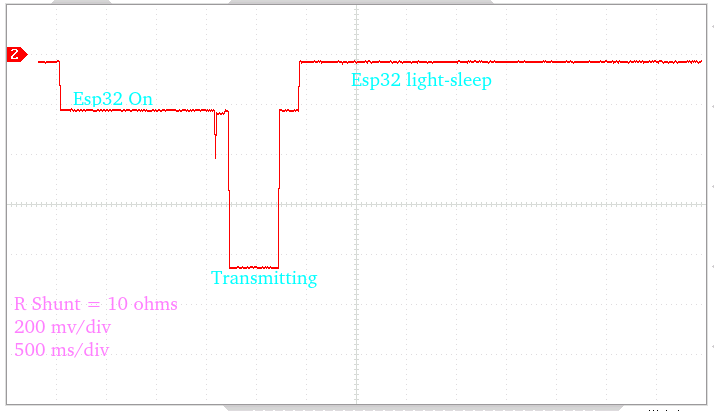
	+ WCM recebendo dados  
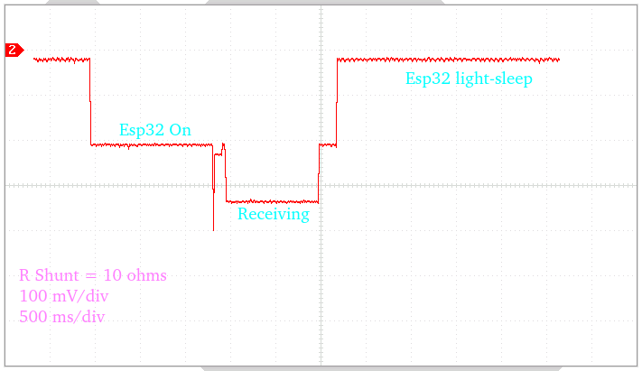

- A figura a seguir mostra o resultado da otimização de consumo do RP2040 e WCM  

- A figura a seguir mostra o gráfico de luminosidade e carga da estação operando ao ar livre, demostrando a carga da bateria em momentos de luminozidade alta.  
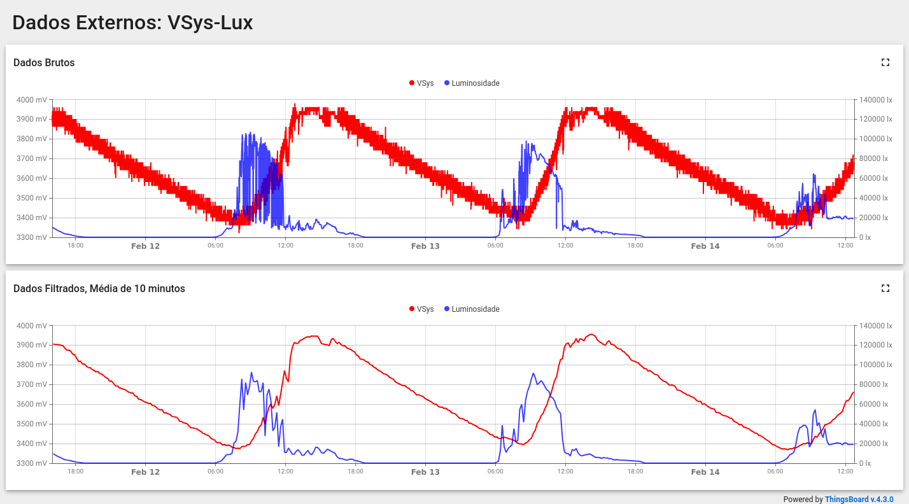

### 5.3 Evidência de Visualização de Dados

O dashboard abaixo contém dados da estação montada dentro do laboratório, sem painel solar. Nele, pode-se observar os seguintes eventos:
- A oscilação da temperatura e da umidade causada pelo liga-desliga do ar condicionado;
- Os momentos em que a iluminação interna é ligada e desligada;
- O esgotamento da bateria.  

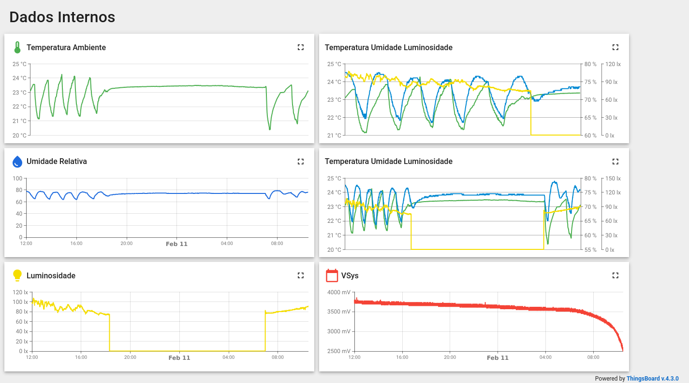

Neste outro Dashboard, com dados de 10/02, na estação montada ao ar livre, pode-se observar os seguintes eventos:  
- Uma queda expressiva na pressão atmosférica entre 13 e 18 horas;
- Uma queda expressiva na temperatura entre 16 e 18 horas e 30 minutos.  

Cabe notar que foram observadas tempestades na região por volta das 18 horas.  

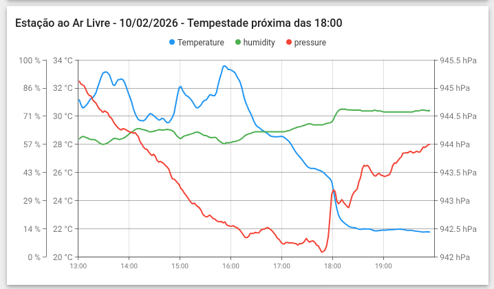

---

## 6. Avaliação de Maturidade Tecnológica (TRL)

Estado ao final da Etapa 4: **TRL 5 -- Tecnologia validada em ambiente
relevante.**

Estado ao final da Etapa 5: Com a implantação em campo, operação
integrada e backend funcional, o projeto aproxima-se de **TRL 7 -- Demonstração de protótipo em ambiente operacional.**

A consolidação formal do TRL 7 dependerá de operação contínua prolongada
e coleta sistemática de dados.

---

## 7. Resultados Consolidados

-   Arquitetura modular e escalável;
-   Payload LoRaWAN otimizado;
-   Redução expressiva de consumo energético e carga via placar solar;
-   Integração real com TTN e ThingsBoard;
-   Hardware dedicado ao projeto;
-   Sistema preparado para replicação em escala.

---
  
## 8. Custo da estação

| Módulo              | Custo estimado|
| :-----------------: | ----------------: |
| Placa Principal     | R$ 114,69 |
| WCM                 | R$ 164,16 |
| Sensores            | R$ 83,97  | 
| Itens de Instalação | R$ 328,85 |
| **TOTAL** | **R$ 691,67** |

A título de comparação, uma estação comercial com LoRa, colocada no mercado nacional, pode ser obtida ao preço de R# 1.390,44, como informa https://www.mercadolivre.com.br/estaco-meteorologica-lora-7-em-1-com-sistema-de/p/MLB2030746108.

---
  
## 9. Conclusão

A Estação Meteorológica IoT desenvolvida demonstra viabilidade técnica,
maturidade arquitetural e potencial de escalabilidade.

O sistema encontra-se apto para expansão para múltiplas unidades,
operação contínua e evolução tecnológica futura.

---
  
---
  
## Anexos

Os anexos abaixo encontram-se dentro da pasta:  

https://github.com/EmbarcaTech-2025/projeto-final-antonio_carlos_ricardo/tree/main/DocumentacaoFinalDoProjeto

Obs.: Abaixo estão apenas o caminho e o nome do arquivo

### Manual do Usuário

Doc/Manual_Usuário/Manual_Usuario.md

### Planilha de Custos
Doc/BillOfMaterial_With_Cost.ods  
Doc/BillOfMaterial_With_Cost.pdf

### Mapeamento do sinal LoRaWAN
Doc/Dados_TX_LoRa.pdf

### Código Fonte
#### Placa Principal (Pico - RP2040)
Software/Main_Board

#### Placa WCM (ESP32-C3)
Software/WCM

#### Decodificador de Paylod para o TTN
Software/TTN_Payload_Decode

### Esquemáticos e PCB
#### Placa Principal (Pico - RP2040)
Hardware/MainBoard

#### Placa WCM (ESP32-C3)
Hardware/WCM
