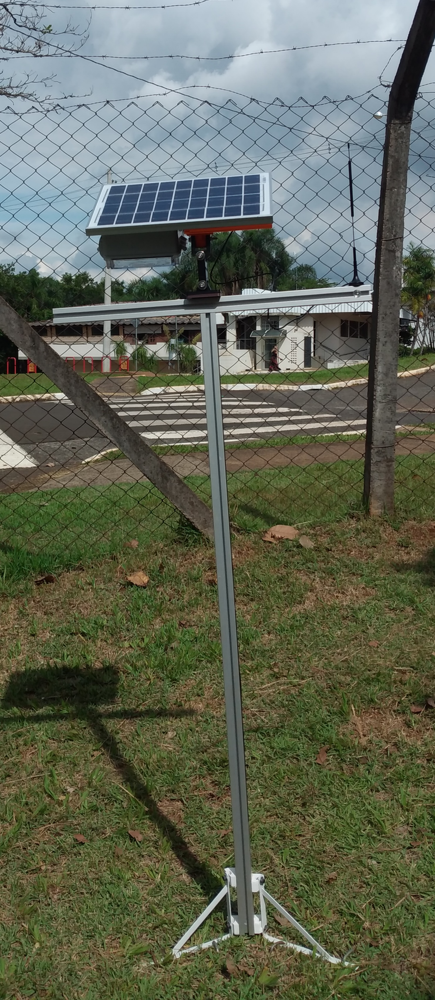
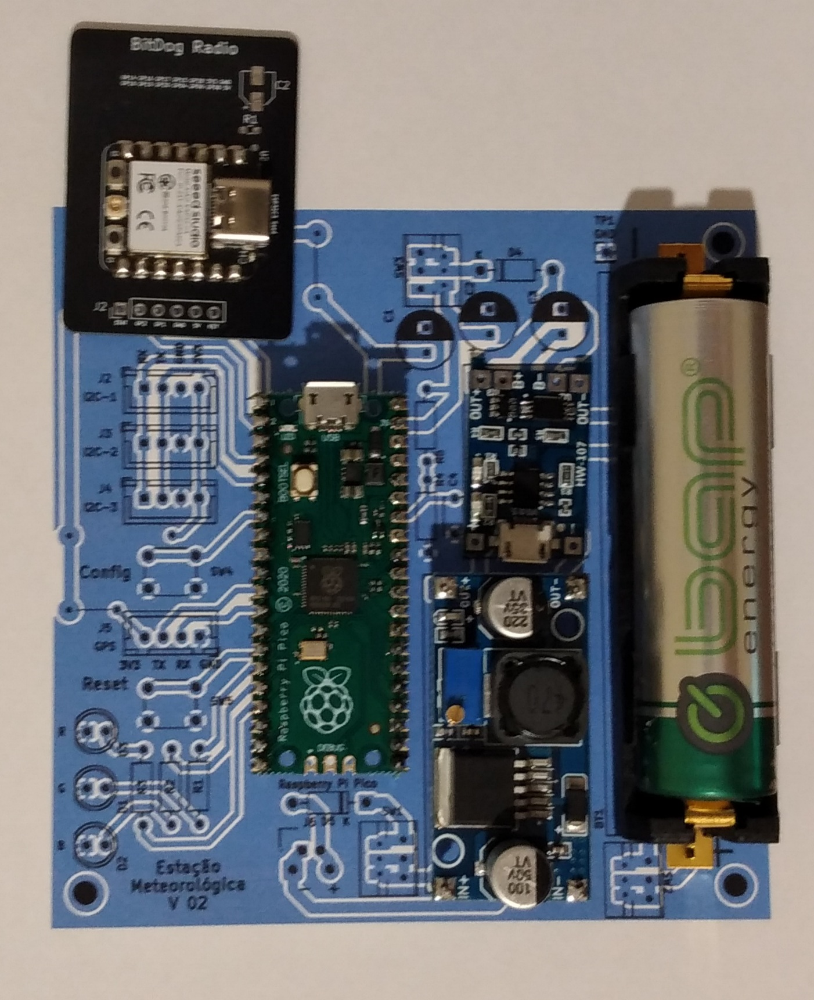
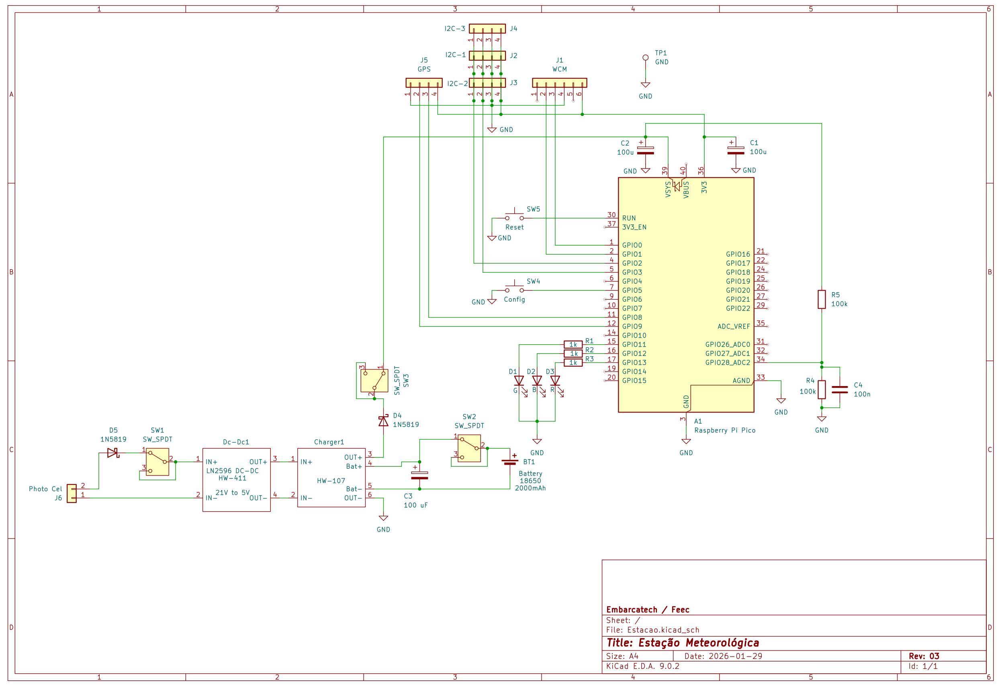
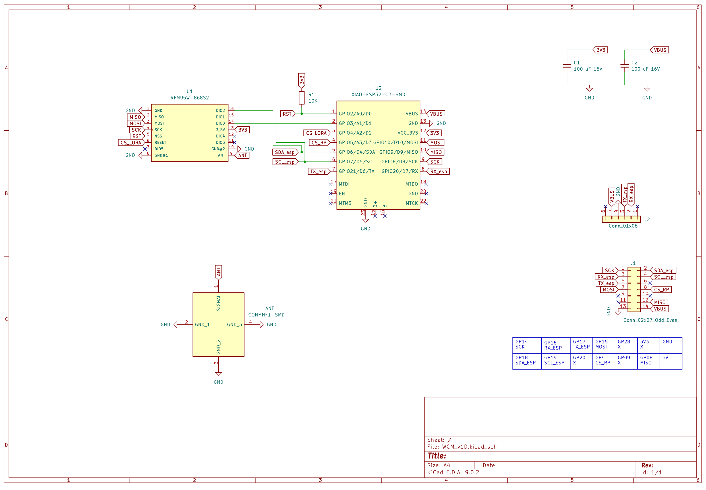
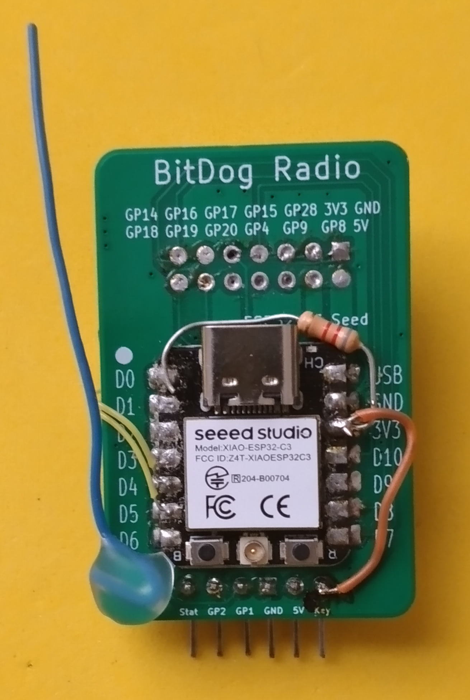
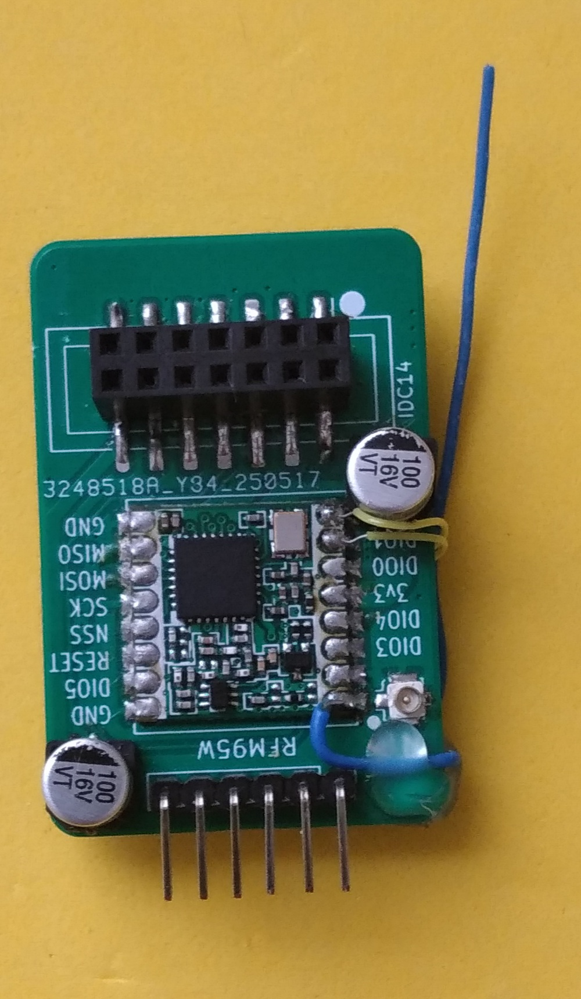
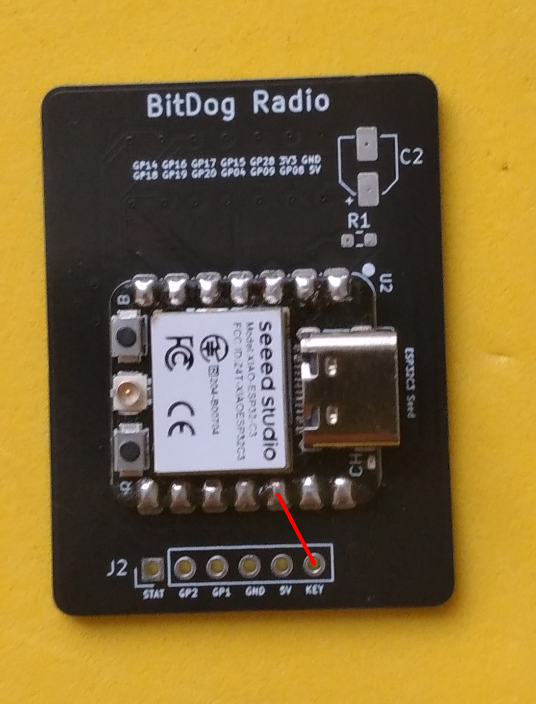
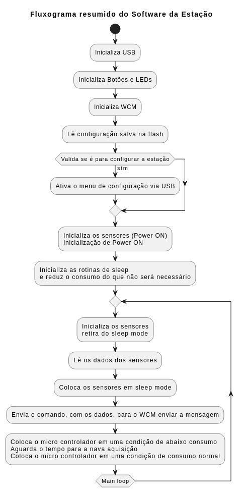
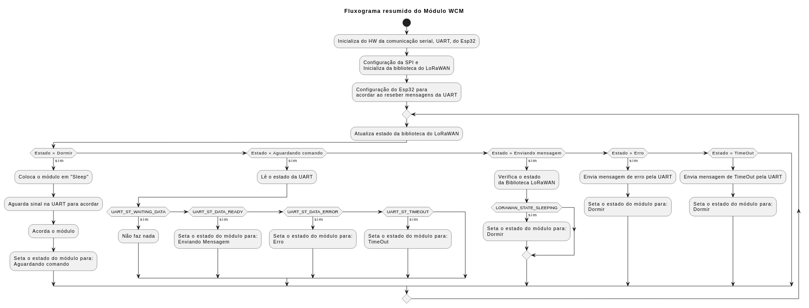
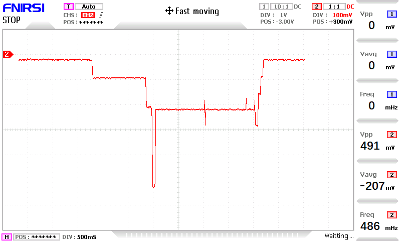

# Descrição Técnica do Projeto da Estação Meteorológica

**Autores: Antonio - Carlos - Ricardo**
**Data: 15/02/2026**

## Hardware

Principais elementos da Estação Meteorológica:  
- Placa principal;
- Módulo WCM;
- Base de fixação;
- Caixa da PCB;
- Painel Solar;
- Invólucro do luxímetro;
- Invólucro do BME280;
- GPS;
- Antena LoRa.  

### PCB da Estação

Principais elementos da PCB:
- Fonte de Energia:
	+ Conversor DC-DC de 21V para 5V - permite que o painel solar que funciona na faixa dos 21V alimente com segurança o carregador de bateria;
	+ Carregador de Bateria com circuito de proteção - carrega a bateria e a protege contra cutto circuito e descarga além do limite permitido;
	+ Obs.: Todos os demais elementos da PCB são alimentados com 3v3 fornecido pelo regulador buck-boost da placa Raspberry Pi Pico.
- MPU:
	+ Placa Raspberry Pi Pico (RP2040) - possui as funções de:
		* Gerar 3V3 a partir da bateria;
		* Orquestrar todo o funcionamento da estação.
- WCM - LoRaWAN:
	+ Permite que através de comandos seriais via UART faça a transmissão das informações através do protocolo LoRaWAN.
- Conectore3s para os sensores:
	+ BME280 - permite, via I2C, medir temperatura, pressão e umidade atmosférica;
	+ BH1750 - permite, via I2C, medir a luminosodade visível incidente;
	+ GPS - permite, via UART, obter a localização geográfica da estação, ou seja, latitude, longitude e altitude.
- Sinalização:
	+ Três LEDs (R, G e B) - indicam em que estágio o software se encontra.

A figura a seguir mostra a distribuição dos principais elementos na PCB

A figura a seguir mostra a PCB Montada

A figura a seguir nostra o esquema Elétrico da PCB

- A PCB possui 3 chaves, que são úteis para a aperação. Em operação normal todas devem estar ligadas.
Função das chaves:  
	- SW1: Liga o Painel solar, permitindo, se desligado, que a estação só funcione via bateria. Isso é útil para se medir a autonomia da estação sem a carga do painel solar.
	- SW2: Liga a bateria, permitindo, se desligado, que a estação só funcione com o painel solar. Isso é fortemente não recomendado.
	- SW3: Liga efetivamente a estação.  
    Portanto, é possível:
	    - A estação operar só com a bateria;
	    - A bateria ser carregada pelo painel solar enquanto a estação está desligada;
	    - A bateria ser carregada pelo painel solar enquanto a estação está ligada.
  
- O Botão SW4 (Config) é utilizado para que a estação entre no modo de configuração ao energizar a estação (vide manual do usuário).

- O Botão SW5 (Reset) é utilizado para reinicializar o MCU sem ter a necessidade de desligar a placa.

- Os resistores R1, R2 e R3 tem como função limitar as correntes nos LEDs.

- Os resistores R4 e R5 integram um divisor resistivo para que o AD do RP2040 possa monitorar de forma segura a tensão do VSys, que é bem próxima a tensão da bateria. C4 ajuda na estabilização da leitura de tensão.
 
- D1, D2 e D3 são os LEDs de sinalização da placa.

- D4 tem como função evitar que quando a placa estiver conectada em uma porta USB, a bateria seja incorretamente carregada por esse meio.
 
- D5 tem como função evitar que a ligação invertida do painel solar danifique a placa.

- C1, C2 e C3 ajudam na estabilização da alimentação da placa.

### WCM
Principais elementos do WCM:
- XIAO-Esp32-c3 - traduz os comandos recebidos via UART em pacotes LoRaWAN e os direciona para o RFM95W respeitando as sequencias e os tempos dos comandos necessários.

- RFM95W - rádio LoRa, agrega todos os circuitos de RF (Transmissor, Receptor, PLL, etc), moduladores e demoduladores de sinal e circuitos auxiliares para a transmissão e recepção do sinal.

A figura abaixo mostra o esquema fornecido pela equipe da Unicamp.
    

WCM antiga visão frontal:
  

WCM antiga visão traseira:
  

WCM nova com correção:
  

## Software

### Estação

### WCM

O software do WCM foi desenvolvido para que:  
- Ao receber um nível low no RX da uart, o WCM acorda e aguarda comandos;
- Caso o WCM não receba comandos completos (Timeout), ou receba comandos inválidos, retornará para o light-sleep mode;
- Há dois comandos válidos:
	+ Comando de envio de mensagem via ABP;
 	+ Comando de envio de mensagem via OTAA.
- Ao receber o comando válido o WCM fará a codificação LoRaWAN e transmitirá. Caso obtenha sucesso na operação retornará OK. Caso contrário, não retornará nada.

## Estratégia de Consumo de Energia
Utilizou-se, no desenvolvimento do firmware, uma abordagem para reduzir ao máximo o consumo de energia. Consegui-se, com isso, uma redução expressiva de consumo. Ainda assim, outros avanços podem ser obtidos através da utilização de um MPU único com modo deep sleep.  
Cabe ressaltar que a utilização de estratégias de sleep mode podem ocasionar efeitos colaterais, como a demora na obtenção de novas aquisições.  

Abaixo temos uma amostra de como ficou o consumo do MPU e do WCM. Pode-se notar claramente os estados:  
- MPU e WCM em "sleep";
- MPU ativo e WCM em "sleep";
- MPU e WCM ativos (curto espaço de tempo);
- MPU e WCM ativos, WCM transmitindo;
- MPU e WCM ativos, com alguns transientes, provavelmente por ativação do modo de escuta do rádio;
- Entrada em sleep mode do WCM e na sequencia do MPU;
- MPU e WCM em sleep.

Alguns pontos relevantes para a redução do consumo do RP2040, são:  
- Desativação dos clocks desnecessários;
- Redução do Clock principal de 125MHz para 12MHz;
- Desativação dos PLLs.

Com relação ao Esp32-C3, a abordagem de redução de consumo contituiu-se no uso de light sleep, presente neste MPU.

