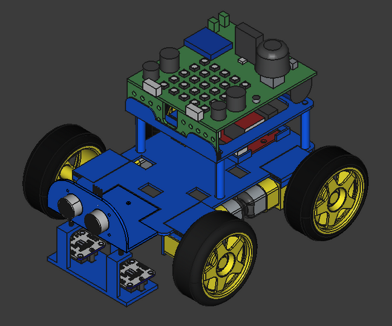
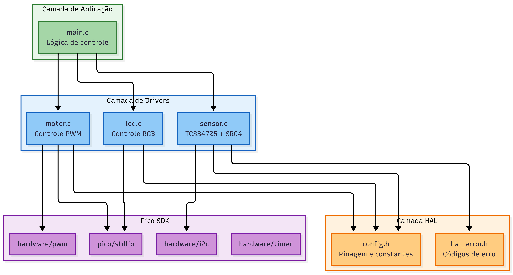
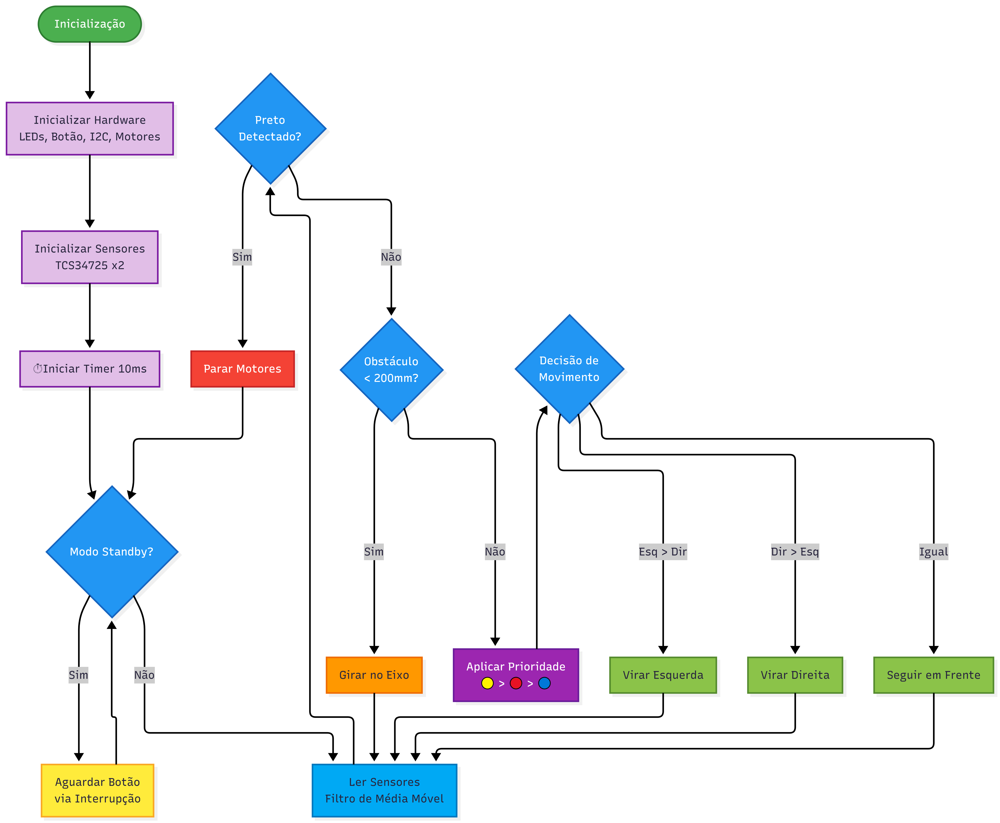
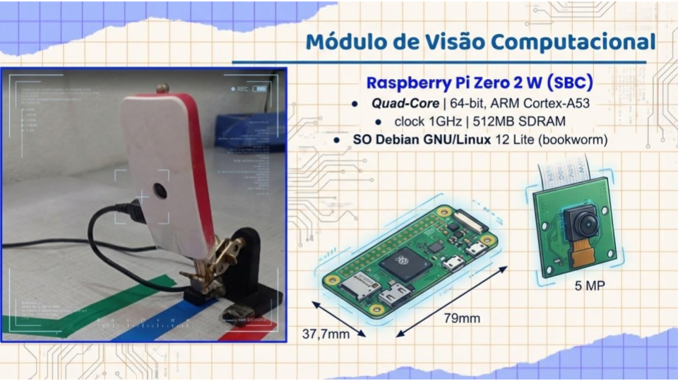
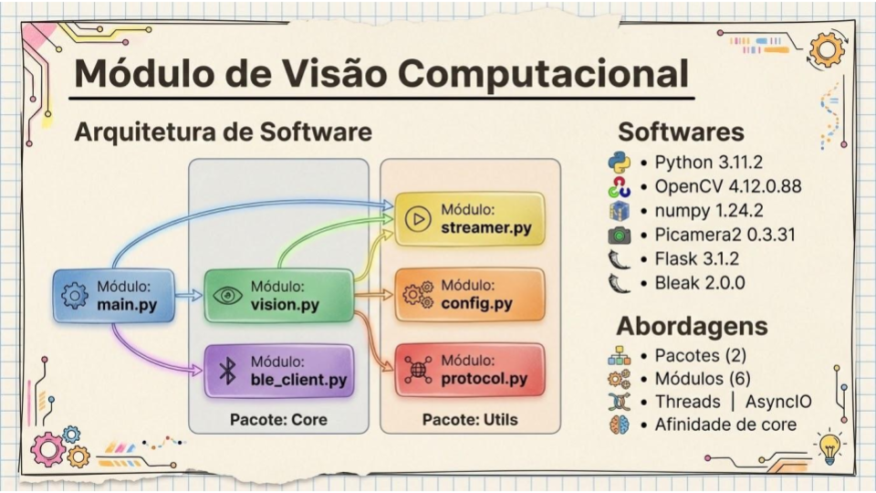
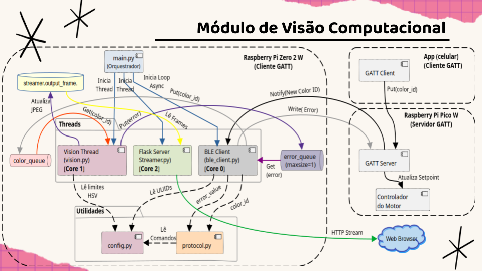

# Robô Seguidor de faixa colorida com módulo de Visão Computacional inteligente

---
## Equipe:   
### Desenvolvimento: 
- [Luan Felipe Azzi](https://www.linkedin.com/in/luan-azzi/) - Robô Móvel (UCR)
- [Vagner Sanches Vasconcelos](https://www.linkedin.com/in/vsvasconcelos/) - Visão Computacional (UPV)
### Orientação:
- [Vinicius Ares](https://www.linkedin.com/in/viniciusares/)
### Coordenação:
- [Prof. Dr. Fabiano Fruett](https://www.linkedin.com/in/fabiano-fruett-816008245/)

---
## :wrench: Conteúdo   
| Pasta            | Descrição    |
|-----------------------|---------------|
| etapa_1    |Conhecendo o cliente e arquitetura do sistema |
| etapa_2    |Desenvolvimento e integração parcial dos módulos |
| etapa_3    |Testes e otimização dos sistemas |
| etapa_4    |Validação e documentação técnica final |
| etapa_5    |Entrega final |
---
## :dart: Objetivo do projeto
O objetivo geral do projeto é elevar o nível de maturidade tecnológica (TRL) de um robô móvel que, além de se locomover, será capaz de seguir diferentes cores e desviar de obstáculos no trajeto. Também é escopo um módulo de Visão Computacional inteligente que, acoplado ao robô, ampliará suas habilidades e permitirá ainda a incorporação de estratégias de controle com base em IA ao robô.

---
## Módulos   
O projeto possui dois módulos:    
- Unidade de Controle do Robô - UCR (BitDogLab - MPU Pi Pico W);     
- Unidade de Processamento de Visão - UPV (SBC - Pi Zero 2 W).     
A comunicação entre eles ocorre por meio de BLE (Bluetooth Low Energy).    

---
### Unidade de Controle do Robô
Este projeto implementa um robô autônomo que:
- **Segue linhas coloridas** com prioridade: 🟡 Amarelo > 🔴 Vermelho > 🔵 Azul
- **Para quando detecta preto** (linha de parada)
- **Evita obstáculos** usando sensor ultrassônico
- **Indica status** através de LED RGB

#### Hardware Necessário

| Componente | Quantidade | Descrição |
|------------|:----------:|-----------|
| BitDogLab | 1 | Microcontrolador principal |
| TCS34725 | 2 | Sensor de cor I2C (esquerdo/direito) |
| SR04 (módulo I2C) | 1 | Sensor ultrassônico para obstáculos |
| BitMovel | 1 | Driver de motor |
| Motor DC | 2 | Motores para as rodas |
| LED RGB | 1 | Indicador de status |
| Botão | 1 | Start/Stop |

#### A arquitetura de software

#### Fluxograma de software    

---
### Unidade de Processamento de Visão  
A UPV utiliza a SBC Pi Zero 2W com câmera de 5 MP.    

#### A arquitetura de software

#### Diagrama de arquitetura e fluxos    

## :floppy_disk: Como compilar e executar o código    
---
1. Abra o projeto no VS Code, usando o ambiente com suporte ao SDK do Raspberry Pi Pico (CMake + compilador ARM);
2. Compile o projeto normalmente (Ctrl+Shift+B no VS Code ou via terminal com cmake e make);
3. Conecte sua BitDogLab via cabo USB e coloque a Pico no modo de boot (pressione o botão BOOTSEL e conecte o cabo);
4. Copie o arquivo .uf2 gerado para a unidade de armazenamento que aparece (RPI-RP2);
5. A Pico reiniciará automaticamente e começará a executar o código.

---
## :movie_camera: Imagens e/ou vídeos do projeto em funcionamento    

### Unidade de Controle do Robô

### Unidade de Processamento de Visão   
 

---
## :chart_with_upwards_trend: Resultados esperados ou obtidos     

### Unidade de Controle do Robô

A UCR foi capaz de seguir as linhas coloridas individualmente (🟡 Amarelo, 🔴 Vermelho, 🔵 Azul), parar quando detectou preto (linha de parada) e evitar obstáculos usando sensor ultrassônico. O LED RGB indicava o status do robô.

---
## Referências:
-
-
